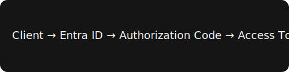

# Azure Entra ID

Azure Entra ID (formerly Azure Active Directory) is Microsoft's cloud-based identity and access management service.

## Key Concepts

- **Tenant** — a dedicated instance of Entra ID representing an organization.
- **App Registration** — how an application identifies itself to Entra ID.
- **Service Principal** — the local representation of an app registration within a tenant.

## Authentication Flow



1. The client redirects the user to the Entra ID authorization endpoint.
2. The user signs in and consents to the requested permissions.
3. Entra ID issues an authorization code back to the client.
4. The client exchanges the code for an access token and (optionally) a refresh token.

Here's the same request using the client credentials grant:

```bash
curl -X POST https://login.microsoftonline.com/{tenant}/oauth2/v2.0/token \
  -d "client_id={client_id}" \
  -d "client_secret={client_secret}" \
  -d "grant_type=client_credentials" \
  -d "scope=https://graph.microsoft.com/.default"
```

The response contains an `access_token` and an `expires_in` value, in seconds.

## Common Use Cases

| Scenario | Recommended Flow |
| --- | --- |
| Web app with a signed-in user | Authorization Code + PKCE |
| Daemon / background service | Client Credentials |
| Native / mobile app | Authorization Code + PKCE |

## Rollout Checklist

- [x] Register the application in Entra ID
- [x] Configure redirect URIs
- [ ] Rotate client secrets on a schedule
- [ ] Enable conditional access policies

Learn more in the [official Microsoft identity platform docs](https://learn.microsoft.com/entra/identity-platform/).

> Always scope tokens to the minimum permissions required (least privilege).

---

Related: see the [OAuth 2.0](/learning/authentication/oauth) notes for the underlying authorization framework.
