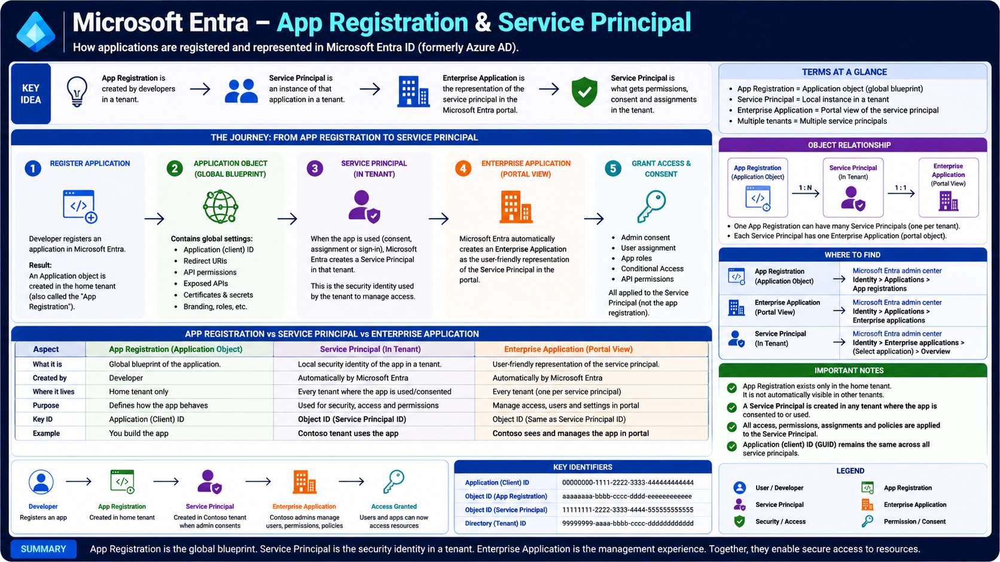

# Microsoft Entra – App Registration & Service Principal

Microsoft Entra allows applications to securely authenticate users and access protected resources. Before an application can use Microsoft Entra, it must be registered. This process creates an **Application Object**, which acts as the global blueprint of the application.

When that application is used inside a tenant, Microsoft Entra automatically creates a **Service Principal**. The Service Principal is the application's identity within that tenant and is responsible for authentication, authorization, permissions, and access management.

Together, **App Registration**, **Service Principal**, and **Enterprise Application** form the foundation of application identity in Microsoft Entra.

---

# Architecture Diagram

The following diagram illustrates the complete journey from registering an application to granting secure access.



---

# Learning Objectives

After completing this article, you will understand:

- What App Registration is
- What an Application Object is
- What a Service Principal is
- What an Enterprise Application is
- The relationship between these objects
- Permissions and Consent
- Key identifiers
- Authentication flow
- Single-tenant and Multi-tenant behavior

---

# Why Do Applications Need Registration?

Applications cannot directly authenticate users with Microsoft Entra.

Instead, Microsoft Entra needs information about the application, such as:

- Application name
- Redirect URIs
- Supported account types
- API permissions
- Authentication settings
- Certificates or client secrets

This information is stored in an **Application Object**, which is created during App Registration.

---

# Step 1 – App Registration

The process begins when a developer registers an application in Microsoft Entra.

During registration, Microsoft Entra creates an **Application Object** inside the application's home tenant.

This object acts as the global blueprint of the application.

It stores:

- Application (Client) ID
- Redirect URIs
- Authentication settings
- API Permissions
- Certificates & Secrets
- Branding
- Exposed APIs
- Supported Account Types

The Application Object exists only in the application's home tenant.

---

# Step 2 – Application Object

The Application Object defines how an application behaves.

It contains the application's configuration but **does not authenticate users or access resources**.

Instead, it serves as the template used to create Service Principals.

One Application Object can create multiple Service Principals across different Microsoft Entra tenants.

---

# Step 3 – Service Principal

When an application is used inside a tenant—through user sign-in, admin consent, or assignment—Microsoft Entra automatically creates a **Service Principal**.

The Service Principal is the application's identity within that tenant.

Unlike the Application Object, the Service Principal is tenant-specific.

It is responsible for:

- Authentication
- Authorization
- Role Assignments
- Conditional Access
- API Permissions
- Consent
- Resource Access

Every tenant has its own Service Principal for the application.

---

# Step 4 – Enterprise Application

An **Enterprise Application** is the portal representation of the Service Principal.

It provides administrators with a management interface where they can:

- Assign users and groups
- Configure Single Sign-On (SSO)
- Manage permissions
- Grant admin consent
- Configure Conditional Access
- Review sign-in logs
- Manage provisioning

Although it appears as a separate object in the portal, it represents the underlying Service Principal.

---

# Step 5 – Grant Access & Consent

After the Service Principal is created, administrators grant permissions and configure access.

Common configurations include:

- Admin Consent
- User Assignment
- App Roles
- API Permissions
- Conditional Access Policies

These settings are applied to the **Service Principal**, not the App Registration.

---

# Object Relationship

The relationship between these objects is straightforward.

```text
Developer
      │
      ▼
App Registration
(Application Object)
      │
      ▼
Service Principal
(Tenant Identity)
      │
      ▼
Enterprise Application
(Portal View)
      │
      ▼
Permissions & Consent
      │
      ▼
Access Protected Resources
```

---

# App Registration vs Service Principal vs Enterprise Application

| Feature    | App Registration             | Service Principal          | Enterprise Application              |
| ---------- | ---------------------------- | -------------------------- | ----------------------------------- |
| Purpose    | Global application blueprint | Tenant-specific identity   | Management portal                   |
| Created By | Developer                    | Microsoft Entra            | Microsoft Entra                     |
| Exists In  | Home tenant only             | Every tenant using the app | Every tenant using the app          |
| Stores     | Application configuration    | Permissions & access       | Administration settings             |
| Key ID     | Application (Client) ID      | Object ID                  | Same Object ID as Service Principal |

---

# Key Identifiers

Microsoft Entra creates several unique identifiers.

## Application (Client) ID

Identifies the application globally.

The Client ID remains the same across every tenant.

---

## Object ID (Application)

Identifies the Application Object.

This ID exists only in the home tenant.

---

## Object ID (Service Principal)

Identifies the Service Principal within a tenant.

Every tenant receives its own unique Service Principal Object ID.

---

## Directory (Tenant) ID

Identifies the Microsoft Entra tenant where the application or Service Principal exists.

---

# Authentication Flow

The complete authentication process follows these steps:

1. A developer registers an application.
2. Microsoft Entra creates an Application Object.
3. A user or administrator uses the application.
4. Microsoft Entra creates a Service Principal in that tenant.
5. Administrators configure permissions and consent.
6. Microsoft Entra authenticates users.
7. Security tokens are issued.
8. The application accesses protected resources.

---

# Single-Tenant vs Multi-Tenant Applications

## Single-Tenant

- One App Registration
- One Service Principal
- Used only within one organization

## Multi-Tenant

- One App Registration
- Multiple Service Principals
- One Service Principal is created in every tenant where the application is used

This enables SaaS applications to securely serve multiple organizations while maintaining isolated permissions.

---

# Real-World Example

Imagine you build an HR Portal.

1. You register the application in Microsoft Entra.
2. Microsoft Entra creates the Application Object.
3. Employees sign in using Microsoft Entra.
4. Microsoft Entra creates a Service Principal for your organization.
5. Administrators assign permissions through the Enterprise Application.
6. Microsoft Entra issues JWT tokens.
7. The HR Portal securely accesses Microsoft Graph and other protected resources.

---

# Summary

App Registration, Service Principal, and Enterprise Application work together to provide secure application identity in Microsoft Entra.

The Application Object defines how an application behaves, the Service Principal represents the application within a tenant, and the Enterprise Application provides administrators with a portal to manage access and permissions.

Understanding these concepts is essential before learning OAuth 2.0, OpenID Connect, Microsoft Graph, and enterprise authentication flows.

---

# Key Takeaways

- App Registration creates the Application Object.
- The Application Object is the global blueprint of an application.
- Service Principals are tenant-specific identities.
- Enterprise Applications are the management view of Service Principals.
- One App Registration can create many Service Principals.
- Permissions and consent are assigned to the Service Principal.
- The Client ID remains the same across all tenants.
- Each tenant has its own unique Service Principal.
