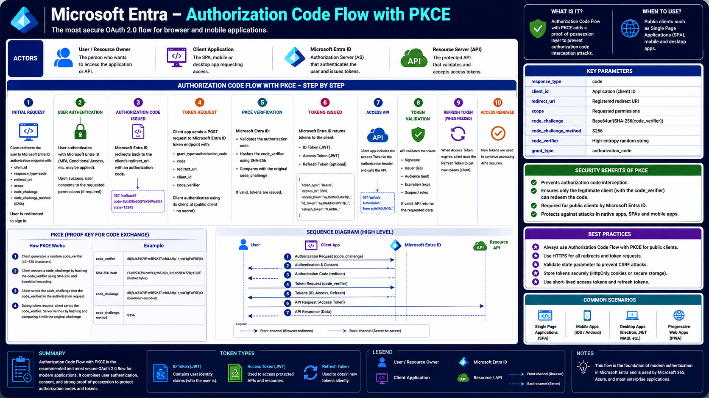

# Microsoft Entra – Authorization Code Flow with PKCE

The **Authorization Code Flow with PKCE (Proof Key for Code Exchange)** is Microsoft's recommended OAuth 2.0 authentication flow for modern public client applications such as **Single Page Applications (SPA)**, **Mobile Applications**, and **Desktop Applications**.

Unlike traditional OAuth flows, PKCE adds an additional security layer that protects authorization codes from interception attacks. Instead of relying on a client secret—which public applications cannot securely store—PKCE uses a **Code Verifier** and a **Code Challenge** to prove that the same application requesting authorization is also redeeming the authorization code.

Today, nearly every Microsoft Entra application built with **MSAL (Microsoft Authentication Library)** uses Authorization Code Flow with PKCE behind the scenes.

---

# Architecture Diagram

The following diagram illustrates the complete Authorization Code Flow with PKCE in Microsoft Entra.



---

# Learning Objectives

After completing this article, you will understand:

- Why PKCE was introduced
- Authorization Code Flow overview
- PKCE architecture
- Code Verifier
- Code Challenge
- Every authentication step
- Token exchange
- Token validation
- Refresh Tokens
- Security benefits
- Best practices
- Common implementation scenarios

---

# Why Was PKCE Introduced?

Originally, the Authorization Code Flow was designed for **confidential client applications**, such as web applications running on secure servers.

These applications could safely store a **Client Secret**.

However, modern applications such as:

- React applications
- Angular applications
- Vue applications
- Mobile apps
- Desktop applications

cannot securely store secrets because anyone can inspect the application code.

Without additional protection, an attacker who intercepted an Authorization Code could exchange it for Access Tokens.

PKCE solves this problem.

Instead of trusting a Client Secret, PKCE proves that the application redeeming the authorization code is the same application that initiated the authentication request.

---

# Actors

Four primary actors participate in the Authorization Code Flow with PKCE.

## User (Resource Owner)

The person attempting to sign in and access protected resources.

Examples include:

- Employees
- Customers
- Administrators

The user authenticates with Microsoft Entra ID.

---

## Client Application

The application requesting authentication.

Examples:

- React SPA
- Angular SPA
- Mobile App
- Desktop Application

This application generates the PKCE values before authentication begins.

---

## Microsoft Entra ID

Microsoft Entra acts as the **Authorization Server**.

Its responsibilities include:

- Authenticating users
- Evaluating Conditional Access policies
- Validating PKCE
- Issuing tokens

---

## Resource Server (API)

The protected API that validates Access Tokens.

Examples include:

- Microsoft Graph
- Azure Resource Manager
- Custom Web APIs

---

# What is Authorization Code Flow with PKCE?

Authorization Code Flow with PKCE is an extension of the standard OAuth 2.0 Authorization Code Flow.

It introduces two additional values:

- Code Verifier
- Code Challenge

These values prevent authorization code interception attacks.

Only the application that generated the original Code Verifier can successfully exchange the Authorization Code for tokens.

---

# Complete Authentication Flow

The authentication process consists of ten major steps.

---

# Step 1 – Initial Authorization Request

The application begins by generating a random **Code Verifier**.

Example:

```text
j4D9s8K2pLmQxYtRwE5nUvH3bZcF1aX7
```

The application hashes the Code Verifier using SHA-256.

This produces the **Code Challenge**.

The browser is then redirected to Microsoft Entra's authorization endpoint.

The request includes:

- Client ID
- Redirect URI
- Response Type
- Scope
- Code Challenge
- Code Challenge Method (S256)

Example request:

```text
GET https://login.microsoftonline.com/{tenant}/oauth2/v2.0/authorize
```

At this point, Microsoft Entra knows which application is requesting authentication.

---

# Step 2 – User Authentication

Microsoft Entra displays the sign-in page.

The user authenticates using one or more methods.

Examples include:

- Username and Password
- Microsoft Authenticator
- Passwordless Sign-in
- Windows Hello
- Security Keys

During authentication Microsoft Entra also evaluates security policies such as:

- Multi-Factor Authentication (MFA)
- Conditional Access
- Identity Protection

If required, user consent is also collected for requested permissions.

Once authentication succeeds, Microsoft Entra prepares an Authorization Code.

---

# Step 3 – Authorization Code Issued

Instead of immediately returning tokens, Microsoft Entra redirects the browser back to the application's registered Redirect URI.

The response contains:

- Authorization Code
- State value

Example:

```text
https://localhost:3000/callback?
code=SplxlOBeZQQYbYS6WxSbIA
&state=12345
```

The Authorization Code is intentionally short-lived.

It cannot be used to call APIs directly.

Its only purpose is to obtain tokens.

---

# Step 4 – Token Request

The application now sends a secure POST request to Microsoft's token endpoint.

Unlike the initial authorization request, this communication happens directly between the application and Microsoft Entra.

The request contains:

- Authorization Code
- Client ID
- Redirect URI
- Code Verifier
- Grant Type

Example Grant Type:

```text
grant_type=authorization_code
```

Unlike confidential clients, no Client Secret is required.

Instead, the Code Verifier proves the application's identity.

---

# Step 5 – PKCE Verification

Microsoft Entra now performs PKCE validation.

It hashes the received Code Verifier using SHA-256.

The generated hash is compared with the original Code Challenge submitted during Step 1.

If they match:

- The application is trusted.
- The Authorization Code is valid.
- Authentication succeeds.

If they do not match:

- Token issuance is denied.
- Authentication fails.
- The Authorization Code becomes unusable.

This additional verification prevents attackers from redeeming intercepted authorization codes.

---

# Step 6 – Tokens Issued

After Microsoft Entra successfully validates the PKCE information, it issues security tokens to the client application.

Depending on the requested scopes and OpenID Connect configuration, Microsoft Entra may return:

- ID Token (JWT)
- Access Token (JWT)
- Refresh Token (Optional)

Example response:

```json
{
  "token_type": "Bearer",
  "expires_in": 3600,
  "access_token": "eyJ0eXAiOiJKV1QiLCJhbGc...",
  "id_token": "eyJ0eXAiOiJKV1QiLCJhbGc...",
  "refresh_token": "0.AAA..."
}
```

Each token serves a different purpose.

| Token         | Purpose                                          |
| ------------- | ------------------------------------------------ |
| ID Token      | Identifies the authenticated user                |
| Access Token  | Access protected APIs                            |
| Refresh Token | Obtain new Access Tokens without another sign-in |

---

# Step 7 – Access Protected APIs

Once the Access Token is received, the client application includes it in every request to a protected API.

Example:

```http
GET https://graph.microsoft.com/v1.0/me

Authorization: Bearer eyJhbGciOi...
```

Examples of APIs include:

- Microsoft Graph
- Azure Resource Manager
- Custom APIs
- Third-party APIs

The Access Token proves that Microsoft Entra has authenticated the user and granted permission to access the requested resource.

---

# Step 8 – Token Validation

Before returning any data, the Resource Server validates the Access Token.

Typical validation includes:

- Digital Signature
- Issuer (`iss`)
- Audience (`aud`)
- Expiration (`exp`)
- Scopes (`scp`)
- Roles
- Tenant ID

If validation succeeds, the API processes the request and returns the requested data.

If validation fails, the request is rejected with an authorization error.

---

# Step 9 – Refresh Token

Access Tokens are intentionally short-lived.

Instead of requiring users to sign in repeatedly, Microsoft Entra issues a Refresh Token.

When the Access Token expires, the application sends the Refresh Token to Microsoft Entra.

Microsoft Entra validates it and returns a new Access Token.

Benefits include:

- Better user experience
- Silent authentication
- Reduced sign-in prompts

---

# Step 10 – Silent Token Renewal

The authentication process continues without interrupting the user.

The sequence becomes:

```text
Access Token Expires

        ↓

Client sends Refresh Token

        ↓

Microsoft Entra validates Refresh Token

        ↓

New Access Token

        ↓

Continue calling APIs
```

The user does not notice this process because it happens in the background.

---

# Understanding PKCE

PKCE stands for **Proof Key for Code Exchange**.

It protects the Authorization Code from interception attacks.

PKCE introduces two new values:

- Code Verifier
- Code Challenge

---

## Code Verifier

The Code Verifier is a long, random string generated by the client application before authentication begins.

Example:

```text
9Jd82kskL20Jdks92KdkLwP092kdLskD9kLs0
```

The Code Verifier never leaves the application until the Token Request.

---

## Code Challenge

The Code Challenge is derived from the Code Verifier.

The application performs:

```text
SHA-256(Code Verifier)

↓

Base64 URL Encoding

↓

Code Challenge
```

Only the Code Challenge is sent during the Authorization Request.

The original Code Verifier remains private.

---

# Why PKCE Works

During the Token Request, Microsoft Entra hashes the received Code Verifier.

It compares the result with the original Code Challenge.

```text
Code Verifier

↓

SHA-256

↓

Generated Challenge

↓

Compare

↓

Original Challenge
```

If they match:

✅ Tokens are issued.

Otherwise:

❌ Authentication fails.

This ensures only the legitimate application can redeem the Authorization Code.

---

# Sequence Diagram Explained

The complete authentication sequence follows this pattern.

```text
User

↓

Client Application

↓

Authorization Request
(code_challenge)

↓

Microsoft Entra ID

↓

Authentication

↓

Authorization Code

↓

Token Request
(code_verifier)

↓

Microsoft Entra validates PKCE

↓

ID Token
Access Token
Refresh Token

↓

Client calls API

↓

Resource Server validates Access Token

↓

Protected Resource Returned
```

---

# Important Request Parameters

Several parameters are required during authentication.

| Parameter             | Purpose                                    |
| --------------------- | ------------------------------------------ |
| response_type         | Indicates Authorization Code flow (`code`) |
| client_id             | Unique Application ID                      |
| redirect_uri          | Registered callback URL                    |
| scope                 | Requested permissions                      |
| code_challenge        | SHA-256 hash of Code Verifier              |
| code_challenge_method | PKCE method (S256)                         |
| code_verifier         | Original random string                     |
| grant_type            | `authorization_code`                       |

Each parameter plays a critical role in securing the authentication process.

---

# Token Types

Microsoft Entra returns different token types depending on the requested scopes.

## ID Token (JWT)

Purpose:

Identify the authenticated user.

Contains claims such as:

- User ID
- Email
- Name
- Roles
- Tenant ID

The application uses this token to establish the user's session.

---

## Access Token (JWT)

Purpose:

Access protected resources.

Contains:

- Scopes
- Permissions
- Audience
- Expiration

Every API request includes the Access Token.

---

## Refresh Token

Purpose:

Request new Access Tokens without requiring the user to authenticate again.

Refresh Tokens improve both usability and security by reducing unnecessary sign-in prompts.

---

# Security Benefits of PKCE

PKCE significantly improves the security of OAuth 2.0 Authorization Code Flow by ensuring that only the application that initiated the authentication request can redeem the Authorization Code.

Without PKCE, an attacker who intercepted the Authorization Code could exchange it for tokens.

With PKCE:

- Authorization Code interception attacks are prevented.
- Only the client that generated the Code Verifier can redeem the Authorization Code.
- Public clients no longer require Client Secrets.
- Microsoft Entra recommends PKCE for all public client applications.

The Code Verifier acts as a proof-of-possession mechanism, ensuring the integrity of the authentication process.

---

# Best Practices

When implementing Authorization Code Flow with PKCE in Microsoft Entra, follow these recommendations.

## Always Use PKCE

Authorization Code Flow with PKCE is the recommended OAuth 2.0 flow for:

- Single Page Applications (SPA)
- Mobile Applications
- Desktop Applications

---

## Always Use HTTPS

Authentication requests and token exchanges should always use HTTPS.

Never transmit tokens over unsecured connections.

---

## Validate the State Parameter

The `state` parameter protects applications from Cross-Site Request Forgery (CSRF) attacks.

Always validate the returned state value before processing the authentication response.

---

## Store Tokens Securely

Never expose tokens in browser storage unless absolutely necessary.

Recommended storage options include:

- Secure HTTP-only Cookies
- Secure platform storage (Mobile/Desktop)
- Encrypted application storage

Avoid storing sensitive tokens in localStorage when possible.

---

## Use Short-Lived Access Tokens

Access Tokens should remain short-lived.

Use Refresh Tokens to obtain new Access Tokens instead of extending Access Token lifetimes.

---

## Follow the Principle of Least Privilege

Request only the permissions your application requires.

For example:

Good:

```text
User.Read
```

Avoid requesting:

```text
Directory.ReadWrite.All
```

unless it is absolutely necessary.

---

# Common Scenarios

Authorization Code Flow with PKCE is the preferred choice for modern applications.

## Single Page Applications (SPA)

Examples:

- React
- Angular
- Vue
- Blazor WebAssembly

These applications run entirely in the browser and cannot securely store Client Secrets.

---

## Mobile Applications

Examples:

- Android
- iOS
- .NET MAUI
- Flutter
- React Native

PKCE protects authentication even if the application package is publicly available.

---

## Desktop Applications

Examples:

- Windows Desktop
- Electron
- .NET MAUI Desktop
- WPF
- WinUI

Desktop applications use PKCE because users can inspect application binaries.

---

## Progressive Web Apps (PWA)

Progressive Web Apps behave similarly to browser applications and benefit from PKCE's additional protection.

---

# Real-World Example

Imagine Contoso develops an Employee Portal using React.

### Step 1

An employee opens:

```text
https://portal.contoso.com
```

---

### Step 2

The application generates:

- Code Verifier
- Code Challenge

The user is redirected to Microsoft Entra.

---

### Step 3

The employee signs in using:

- Username
- Password
- Microsoft Authenticator (MFA)

Microsoft Entra validates the user's identity.

---

### Step 4

Microsoft Entra redirects the browser back to the application with an Authorization Code.

---

### Step 5

The React application sends:

- Authorization Code
- Code Verifier

to the Microsoft Entra Token Endpoint.

---

### Step 6

Microsoft Entra verifies the Code Verifier.

Since it matches the original Code Challenge, Microsoft Entra issues:

- ID Token
- Access Token
- Refresh Token

---

### Step 7

The application uses the Access Token to retrieve employee information from Microsoft Graph.

---

### Step 8

When the Access Token expires, the application silently uses the Refresh Token to obtain a new Access Token.

The employee continues working without signing in again.

---

# Why Microsoft Recommends PKCE

Microsoft recommends Authorization Code Flow with PKCE because it provides:

- Strong protection against Authorization Code interception
- Secure authentication for public clients
- Support for Single Sign-On (SSO)
- Integration with Multi-Factor Authentication
- Compatibility with Conditional Access
- Secure token issuance
- Modern OAuth 2.0 compliance

Today, Microsoft Authentication Library (MSAL) automatically implements PKCE for supported public client applications.

---

# Summary

Authorization Code Flow with PKCE is the recommended OAuth 2.0 authentication flow for modern public client applications.

It enhances the standard Authorization Code Flow by introducing the Code Verifier and Code Challenge, ensuring that intercepted Authorization Codes cannot be redeemed by attackers.

This flow enables secure user authentication, token issuance, and API access while integrating seamlessly with Microsoft Entra features such as Single Sign-On (SSO), Multi-Factor Authentication (MFA), and Conditional Access.

If you're building a browser-based, mobile, or desktop application, Authorization Code Flow with PKCE should be your default authentication choice.

---

# Key Takeaways

- Authorization Code Flow with PKCE is Microsoft's recommended OAuth 2.0 flow for public clients.
- PKCE eliminates the need for a Client Secret in public applications.
- Code Verifier and Code Challenge protect Authorization Codes from interception.
- Microsoft Entra validates PKCE before issuing tokens.
- Applications receive ID Tokens, Access Tokens, and optionally Refresh Tokens.
- Access Tokens authorize API access.
- Refresh Tokens enable silent authentication.
- Always use HTTPS, validate the `state` parameter, and follow the principle of least privilege.
