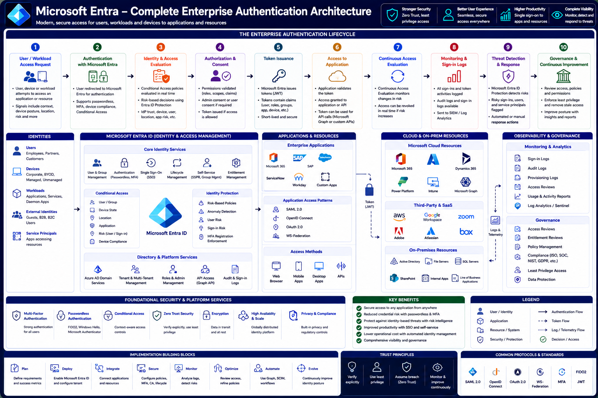

# Microsoft Entra – Complete Enterprise Authentication Architecture

Throughout this documentation series, you've explored the individual building blocks of Microsoft Entra authentication—from identity fundamentals and OAuth 2.0 to Microsoft Graph, JWT validation, permissions, and Conditional Access.

This article brings all of those concepts together into a single end-to-end enterprise authentication architecture.

Modern enterprise authentication is much more than validating a username and password. Every sign-in request passes through multiple security layers that verify identity, evaluate risk, enforce policies, issue cryptographically signed tokens, authorize access to resources, and continuously monitor user activity.

Microsoft Entra provides these capabilities as an integrated identity platform, enabling organizations to securely authenticate users, devices, applications, and workloads across Microsoft cloud services, on-premises environments, and third-party SaaS applications.

---

# Architecture Diagram

---

# Learning Objectives

After completing this article, you will understand:

- The complete Microsoft Entra authentication lifecycle
- Core identity components
- Enterprise authentication architecture
- OAuth 2.0 and OpenID Connect in context
- Token issuance and validation
- Continuous Access Evaluation
- Identity Protection
- Conditional Access
- Enterprise application integration
- Monitoring and governance
- Zero Trust implementation

---

# Enterprise Authentication Lifecycle

The complete authentication lifecycle consists of ten major stages.

1. User or workload requests access.
2. Microsoft Entra authenticates the identity.
3. Identity and access signals are evaluated.
4. Authorization and consent are verified.
5. Secure tokens are issued.
6. Applications validate tokens.
7. Continuous access is evaluated.
8. Sign-ins and activity are monitored.
9. Threats are detected and mitigated.
10. Policies are reviewed and continuously improved.

Together, these stages create a secure, adaptive authentication platform that supports modern enterprise workloads.

---

# Step 1 – User or Workload Requests Access

Every authentication process begins when an identity attempts to access a protected resource.

An identity may be:

- Employee
- Customer
- Partner
- Guest user
- Mobile application
- Web application
- Background service
- Daemon application
- Managed identity

The request may target:

- Microsoft 365
- Microsoft Graph
- Azure resources
- Custom APIs
- Third-party SaaS applications
- On-premises applications

Before authentication begins, Microsoft Entra collects contextual information such as:

- Device information
- IP address
- Geographic location
- Client application
- Requested resource
- Risk signals

These signals are used later during Conditional Access evaluation.

---

# Step 2 – Authentication with Microsoft Entra

The application redirects the user to Microsoft Entra for authentication.

Depending on the configured authentication methods, users may authenticate using:

- Password
- Microsoft Authenticator
- Windows Hello for Business
- FIDO2 Security Keys
- Passkeys
- Certificate-based authentication

Microsoft Entra also evaluates:

- Multi-Factor Authentication (MFA)
- Passwordless authentication
- Device compliance
- Conditional Access prerequisites

Successful authentication establishes the user's identity but does not automatically grant access to the requested resource.

---

# Step 3 – Identity and Access Evaluation

After the user's identity is verified, Microsoft Entra evaluates whether access should be allowed.

Several security services participate in this decision.

## Conditional Access

Conditional Access evaluates policies based on signals such as:

- User
- Group membership
- Application
- Device state
- Device compliance
- Location
- Sign-in risk
- User risk

Policies can:

- Grant access
- Require MFA
- Require a compliant device
- Require hybrid Microsoft Entra joined devices
- Block access

---

## Identity Protection

Microsoft Entra Identity Protection continuously analyzes authentication activity for signs of compromise.

Examples include:

- Anonymous IP addresses
- Impossible travel
- Malware-linked IPs
- Password spray attacks
- Leaked credentials
- Suspicious sign-in behavior

Risk detections can automatically trigger Conditional Access policies.

---

# Step 4 – Authorization and Consent

Once authentication and policy evaluation succeed, Microsoft Entra verifies whether the application is authorized to access the requested resource.

Authorization includes:

- OAuth scopes
- Application roles
- Delegated permissions
- Application permissions
- User consent
- Administrator consent

If administrator approval is required and has not yet been granted, the request stops until the required consent is obtained.

Only after authorization succeeds can Microsoft Entra issue security tokens.

---

# Step 5 – Token Issuance

Microsoft Entra generates cryptographically signed JSON Web Tokens (JWTs).

Depending on the authentication flow, the application may receive:

- ID Token
- Access Token
- Refresh Token

Each token contains claims describing:

- User identity
- Tenant
- Application
- Roles
- Scopes
- Token lifetime
- Device information (where applicable)

Before issuance, Microsoft Entra signs the token using its private RSA key.

The resulting JWT can later be validated using Microsoft's published public keys available through the JWKS endpoint.

---

# Step 6 – Access to Applications and Resources

After Microsoft Entra issues an Access Token, the client application presents it to the target resource.

Protected resources may include:

- Microsoft Graph
- Microsoft 365
- Azure Resource Manager
- Power Platform
- Dynamics 365
- Custom Web APIs
- Third-party SaaS applications
- On-premises applications

Before processing the request, the resource validates the Access Token by checking:

- Digital signature
- Issuer (`iss`)
- Audience (`aud`)
- Expiration (`exp`)
- Scopes (`scp`)
- Roles (`roles`)
- Tenant ID (`tid`)

Only if all validation checks succeed does the application authorize access to the requested resource.

---

# Step 7 – Continuous Access Evaluation

Authentication is not a one-time event. After a token has been issued, Microsoft Entra continues evaluating whether access should remain valid.

This capability is known as **Continuous Access Evaluation (CAE)**.

Examples of events that can trigger reevaluation include:

- User account disabled
- Password reset
- Multi-Factor Authentication requirement changes
- User removed from a security group
- Risk level increases
- Administrator revokes sessions
- Conditional Access policy changes

If one of these events occurs, Microsoft Entra can invalidate existing sessions or require the user to authenticate again.

This reduces the window of opportunity for compromised credentials while minimizing unnecessary authentication prompts.

---

# Step 8 – Monitoring and Sign-in Logs

Every authentication event generates telemetry that administrators can use to monitor security and troubleshoot issues.

Microsoft Entra records information such as:

- Successful sign-ins
- Failed sign-ins
- Token issuance
- Conditional Access decisions
- Authentication methods
- Device information
- Client applications
- Geographic location

This information is available through:

- Sign-in Logs
- Audit Logs
- Microsoft Sentinel
- Azure Monitor
- Log Analytics

Monitoring provides visibility into authentication activity across the organization.

---

# Step 9 – Threat Detection and Response

Microsoft Entra integrates with Microsoft Defender and Microsoft Entra ID Protection to detect identity-based threats.

Examples include:

- Leaked credentials
- Password spray attacks
- Impossible travel
- Anonymous IP addresses
- Malware-linked infrastructure
- Suspicious sign-in patterns
- Privileged account abuse

When threats are detected, automated responses may include:

- Requiring MFA
- Blocking access
- Resetting passwords
- Revoking refresh tokens
- Triggering Conditional Access policies
- Generating security alerts

Organizations can also integrate Microsoft Sentinel to automate investigation and response workflows.

---

# Step 10 – Governance and Continuous Improvement

Identity security is an ongoing process.

Microsoft Entra provides governance capabilities that help organizations maintain secure access over time.

Common governance activities include:

- Reviewing Conditional Access policies
- Performing access reviews
- Managing entitlement assignments
- Removing stale accounts
- Auditing privileged roles
- Reviewing administrator consent
- Monitoring application permissions

Continuous improvement ensures that identity policies evolve alongside business requirements and emerging threats.

---

# Identities

Microsoft Entra supports multiple identity types across an enterprise environment.

## Users

Human identities, including:

- Employees
- Contractors
- Partners
- Customers

Users authenticate interactively to access protected resources.

---

## Devices

Devices represent endpoints used to access applications.

Examples include:

- Corporate laptops
- BYOD devices
- Mobile phones
- Tablets
- Virtual desktops

Device registration and compliance status can influence Conditional Access decisions.

---

## Workloads

Applications and services also require identities.

Examples include:

- Azure Functions
- Web APIs
- Background services
- Automation jobs
- Managed Identities

These workload identities authenticate without user interaction.

---

## External Identities

Microsoft Entra supports collaboration with external organizations through:

- Azure AD B2B
- Azure AD B2C
- Guest users
- External partners

External identities enable secure collaboration without requiring separate identity stores.

---

## Service Principals

Every application accessing Microsoft Entra resources is represented by a Service Principal within a tenant.

Service Principals enable:

- Authentication
- Authorization
- Role assignments
- Application permissions

They are the runtime identities used by applications and services.

---

# Microsoft Entra Core Identity Services

Microsoft Entra provides a comprehensive set of identity and access management services.

## User and Group Management

Manage:

- Users
- Groups
- Dynamic groups
- Administrative units

These objects form the foundation of authorization throughout the platform.

---

## Authentication

Microsoft Entra supports modern authentication methods including:

- Passwords
- Passwordless authentication
- Microsoft Authenticator
- FIDO2 security keys
- Windows Hello for Business
- Certificate-based authentication

These methods help organizations improve both security and user experience.

---

## Single Sign-On (SSO)

Single Sign-On allows users to authenticate once and access multiple applications without repeatedly entering credentials.

Supported protocols include:

- OpenID Connect (OIDC)
- OAuth 2.0
- SAML 2.0
- WS-Federation

SSO simplifies access while reducing password fatigue.

---

## Lifecycle Management

Lifecycle Management automates identity processes such as:

- User onboarding
- Role changes
- Department transfers
- Offboarding

Automation helps ensure that access remains aligned with organizational changes.

---

## Self-Service

Self-service capabilities reduce administrative overhead by allowing users to:

- Reset passwords
- Update profile information
- Manage security information
- Register authentication methods

These features improve productivity while maintaining security.

---

## Entitlement Management

Entitlement Management simplifies access governance by automating:

- Access packages
- Approval workflows
- Access expiration
- Periodic reviews

This helps organizations enforce least-privilege access.

---

# Applications and Resources

Microsoft Entra secures a wide variety of applications and workloads.

## Enterprise Applications

Common enterprise integrations include:

- Microsoft 365
- SAP
- Salesforce
- ServiceNow
- Workday
- Custom line-of-business applications

Microsoft Entra provides centralized authentication and authorization across these platforms.

---

## Application Access Patterns

Applications commonly authenticate using:

- OAuth 2.0
- OpenID Connect
- SAML 2.0
- WS-Federation

The protocol selected depends on the application's architecture and compatibility requirements.

---

## Access Methods

Microsoft Entra supports multiple client types, including:

- Web browsers
- Mobile applications
- Desktop applications
- APIs
- Background services

Regardless of the client type, authentication ultimately results in Microsoft Entra issuing secure tokens used to access protected resources.

---

# Cloud, SaaS, and On-Premises Resources

One of Microsoft Entra's greatest strengths is its ability to provide a single identity platform for applications regardless of where they are hosted.

## Microsoft Cloud Resources

Microsoft Entra secures access to Microsoft cloud services including:

- Microsoft 365
- Azure
- Microsoft Graph
- Power Platform
- Dynamics 365
- Microsoft Intune

These services trust Microsoft Entra-issued Access Tokens and support modern authentication standards.

---

## Third-Party SaaS Applications

Microsoft Entra integrates with thousands of Software-as-a-Service (SaaS) applications.

Examples include:

- Salesforce
- ServiceNow
- SAP
- Workday
- AWS
- Google Workspace
- Zoom
- Adobe
- Atlassian
- Box

Most integrations support:

- Single Sign-On (SSO)
- Conditional Access
- Multi-Factor Authentication (MFA)
- Automated user provisioning using SCIM
- Centralized lifecycle management

This enables organizations to manage authentication consistently across both Microsoft and non-Microsoft applications.

---

## On-Premises Resources

Many organizations continue to operate on-premises infrastructure.

Microsoft Entra extends secure access to resources such as:

- Active Directory
- File Servers
- SQL Server
- SharePoint Server
- Internal web applications
- Line-of-business applications

Using technologies such as Microsoft Entra Application Proxy, Hybrid Identity, and federation, organizations can modernize access to legacy applications without requiring them to be rewritten.

---

# Foundational Security and Platform Services

Enterprise authentication is built upon multiple security capabilities working together.

## Multi-Factor Authentication (MFA)

MFA requires users to provide multiple forms of verification before access is granted.

Supported methods include:

- Microsoft Authenticator
- Windows Hello for Business
- FIDO2 Security Keys
- Passkeys
- SMS and voice (where supported)

MFA significantly reduces the effectiveness of stolen credentials.

---

## Passwordless Authentication

Microsoft Entra supports passwordless authentication methods that improve both security and user experience.

Examples include:

- Passkeys
- Windows Hello for Business
- Microsoft Authenticator
- FIDO2 Security Keys

Passwordless authentication reduces phishing attacks and eliminates password fatigue.

---

## Conditional Access

Conditional Access continuously evaluates authentication requests using contextual signals such as:

- User identity
- Device compliance
- Location
- Risk
- Application
- Authentication strength

Policies dynamically determine whether access should be granted, challenged, or blocked.

---

## Zero Trust Security

Microsoft Entra implements Microsoft's Zero Trust security model.

Its core principles are:

- Verify explicitly.
- Use least-privilege access.
- Assume breach.

Rather than trusting users because they are inside the corporate network, every request is evaluated independently using real-time signals.

---

## Encryption

Security depends on protecting both credentials and data.

Microsoft Entra protects information using:

- TLS encryption for data in transit
- RSA cryptography for token signing
- SHA-256 hashing
- JWT digital signatures

These technologies ensure confidentiality, integrity, and authenticity throughout the authentication process.

---

## High Availability and Scalability

Microsoft Entra is designed as a globally distributed identity platform.

Key characteristics include:

- High availability
- Global redundancy
- Automatic failover
- Regional resiliency
- Elastic scalability

This enables organizations to authenticate millions of users across the world with minimal latency.

---

## Privacy and Compliance

Microsoft Entra helps organizations meet regulatory and compliance requirements by providing:

- Audit logging
- Access reviews
- Identity governance
- Data protection
- Compliance reporting

These capabilities support standards such as ISO 27001, SOC, GDPR, HIPAA, and many industry-specific regulations.

---

# Implementation Building Blocks

Successfully deploying Microsoft Entra involves more than enabling authentication. Organizations should follow a structured implementation approach.

## Plan

Begin by identifying:

- Business requirements
- Security objectives
- Protected resources
- User populations
- Compliance requirements

Planning establishes a strong foundation for the identity platform.

---

## Deploy

Configure the Microsoft Entra tenant by:

- Creating App Registrations
- Configuring Enterprise Applications
- Enabling authentication methods
- Defining Conditional Access policies

Deployment should follow a phased rollout strategy.

---

## Integrate

Connect applications and services using supported protocols such as:

- OAuth 2.0
- OpenID Connect
- SAML 2.0
- SCIM

Ensure applications are registered correctly and request only the permissions they require.

---

## Secure

Apply layered security controls including:

- Multi-Factor Authentication
- Conditional Access
- Identity Protection
- Least-Privilege Access
- Privileged Identity Management (PIM)

Security should be embedded throughout the authentication lifecycle.

---

## Monitor

Continuously monitor identity activity using:

- Sign-in Logs
- Audit Logs
- Microsoft Sentinel
- Log Analytics
- Workbooks

Monitoring enables rapid detection of suspicious activity.

---

## Optimize

Identity platforms evolve over time.

Regularly:

- Review Conditional Access policies
- Remove unused applications
- Update authentication methods
- Reduce unnecessary permissions
- Improve user experience

Optimization ensures the environment remains secure and efficient.

---

## Automate

Reduce manual administration by automating:

- User provisioning
- Access reviews
- Lifecycle workflows
- License assignments
- Governance processes

Automation improves consistency and operational efficiency.

---

## Evolve

Identity security is a continuous journey.

As new technologies and threats emerge:

- Adopt new authentication methods.
- Review Zero Trust maturity.
- Improve governance.
- Expand automation.
- Strengthen monitoring and response capabilities.

Continuous improvement is essential for long-term security.

---

# Zero Trust Principles

Microsoft Entra implements Zero Trust across every stage of authentication.

| Principle                | Description                                                              |
| ------------------------ | ------------------------------------------------------------------------ |
| **Verify Explicitly**    | Validate identity, device, location, and risk for every request.         |
| **Use Least Privilege**  | Grant only the minimum access required.                                  |
| **Assume Breach**        | Continuously monitor, detect, and respond to threats.                    |
| **Monitor Continuously** | Reevaluate sessions using Continuous Access Evaluation and risk signals. |

These principles guide every authentication and authorization decision.

---

# Common Protocols and Standards

Microsoft Entra supports multiple industry-standard protocols.

| Protocol                  | Primary Purpose                            |
| ------------------------- | ------------------------------------------ |
| **OAuth 2.0**             | Authorization                              |
| **OpenID Connect (OIDC)** | Authentication                             |
| **SAML 2.0**              | Enterprise Single Sign-On                  |
| **WS-Federation**         | Legacy federation scenarios                |
| **SCIM**                  | User provisioning and lifecycle management |
| **JWT**                   | Secure token format                        |
| **FIDO2**                 | Passwordless authentication                |

These standards enable interoperability between Microsoft Entra, enterprise applications, and third-party identity providers.

---

# Best Practices

To build a secure and scalable Microsoft Entra environment:

- Implement Zero Trust principles from the beginning.
- Enable Multi-Factor Authentication for all users.
- Prefer passwordless authentication where possible.
- Protect privileged accounts with stronger authentication methods.
- Use Conditional Access to enforce adaptive access decisions.
- Grant only the minimum permissions required.
- Monitor sign-in activity and audit logs continuously.
- Regularly review access, consent, and application permissions.
- Automate identity lifecycle management wherever possible.
- Keep applications updated to use modern authentication protocols.

---

# Summary

Microsoft Entra provides a comprehensive enterprise identity platform that unifies authentication, authorization, governance, and security across cloud, on-premises, and SaaS environments.

Throughout the authentication lifecycle, Microsoft Entra verifies identities, evaluates contextual risk, enforces Conditional Access policies, issues cryptographically signed tokens, and continuously monitors user and application activity. Combined with Microsoft Graph, Identity Protection, governance capabilities, and Zero Trust principles, it enables organizations to deliver secure, scalable, and seamless access to applications and resources.

Understanding how these components work together allows architects, administrators, and developers to design identity solutions that balance strong security with an excellent user experience.

---

# Key Takeaways

- Microsoft Entra is a complete enterprise identity and access management platform.
- Authentication involves identity verification, policy evaluation, authorization, token issuance, and continuous monitoring.
- OAuth 2.0, OpenID Connect, JWT, Microsoft Graph, and Conditional Access work together to secure applications.
- Zero Trust principles are enforced throughout the authentication lifecycle.
- Continuous Access Evaluation, Identity Protection, and governance help maintain security after sign-in.
- Monitoring, automation, and regular policy reviews are essential for long-term operational success.
- Modern authentication standards enable secure integration with Microsoft, third-party SaaS, and on-premises applications.

---

# Congratulations

You have completed the **Microsoft Entra Authentication Architecture** learning path.

Over the course of this documentation series, you explored:

1. Identity Fundamentals
2. Microsoft Entra Core Architecture
3. App Registration & Service Principal
4. OAuth 2.0 & OpenID Connect
5. OAuth Flow Comparison
6. Authorization Code Flow with PKCE
7. JWT Token Architecture
8. Cryptography Deep Dive
9. Microsoft Graph
10. Permissions & Consent
11. Conditional Access
12. Complete Enterprise Authentication Architecture

Together, these articles provide a complete foundation for understanding how Microsoft Entra secures identities, applications, APIs, and enterprise resources using modern identity standards and Zero Trust principles.
