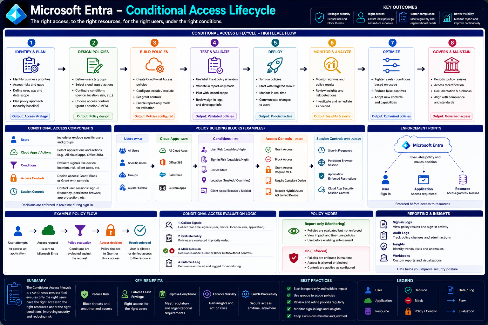

# Microsoft Entra – Conditional Access

Microsoft Entra Conditional Access is Microsoft's policy engine for enforcing adaptive access decisions. Rather than granting access based solely on a successful sign-in, Conditional Access evaluates multiple signals—such as user identity, device compliance, location, application, and risk—to determine whether access should be granted, blocked, or require additional controls.

Conditional Access is a core component of Microsoft's **Zero Trust** security strategy, ensuring that the right users receive the right level of access to the right resources under the right conditions.

---

# Architecture Diagram



---

# Learning Objectives

After completing this article, you will understand:

- What Conditional Access is
- How Conditional Access supports Zero Trust
- The Conditional Access lifecycle
- Policy building blocks
- Policy evaluation logic
- Access controls
- Session controls
- Enforcement points
- Policy modes
- Monitoring and reporting
- Best practices

---

# What is Conditional Access?

Conditional Access is a policy-based access control system that evaluates every authentication request before access is granted to protected resources.

Instead of relying on a single authentication event, Microsoft Entra continuously evaluates contextual signals such as:

- Who is signing in
- Which application is being accessed
- Device state
- User risk
- Sign-in risk
- Geographic location
- Client application
- Session context

Based on these signals, Microsoft Entra determines whether to:

- Allow access
- Require additional verification
- Apply session restrictions
- Block access completely

---

# Zero Trust and Conditional Access

Conditional Access is one of the primary enforcement mechanisms for Microsoft's Zero Trust security model.

Zero Trust is based on three guiding principles:

- Verify explicitly.
- Use least-privilege access.
- Assume breach.

Conditional Access implements these principles by ensuring that every access request is evaluated against organizational security policies before access is granted.

For example, an organization might require:

- Multi-Factor Authentication (MFA) when users sign in from outside the corporate network.
- A compliant device before accessing sensitive applications.
- Stronger authentication for administrative accounts.
- Access to be blocked from high-risk locations.

Rather than using static security rules, Conditional Access continuously adapts its decisions based on the current sign-in context.

---

# Conditional Access Lifecycle

Implementing Conditional Access is an ongoing process rather than a one-time configuration. The lifecycle consists of eight major phases.

## Step 1 – Identify and Plan

The first step is understanding business requirements and security objectives.

Typical planning activities include:

- Identifying critical applications
- Defining protected resources
- Assessing security risks
- Determining which users and groups require protection
- Establishing a security baseline

**Output:** An access strategy aligned with business and security goals.

---

## Step 2 – Design Policies

Once requirements are understood, administrators design Conditional Access policies.

This includes selecting:

- Users and groups
- Cloud applications
- Conditions
- Grant controls
- Session controls

At this stage, no policies are enforced; the focus is on designing appropriate access rules.

**Output:** Policy design.

---

## Step 3 – Build Policies

Administrators configure Conditional Access policies within Microsoft Entra.

Typical configuration tasks include:

- Creating new policies
- Selecting included and excluded users
- Defining conditions
- Configuring grant controls
- Configuring session controls
- Enabling Report-only mode for testing

Policies should initially be created without affecting production users.

**Output:** Configured policies.

---

## Step 4 – Test and Validate

Before enabling enforcement, policies should be thoroughly tested.

Microsoft Entra provides several validation capabilities:

- What If analysis
- Policy simulation
- Report-only mode
- Sign-in log review

Testing helps identify unintended access restrictions before policies are enforced.

**Output:** Validated policies ready for deployment.

---

## Step 5 – Deploy

Once validated, policies can be enabled for production.

Recommended rollout strategy:

- Start with a small pilot group.
- Monitor sign-in activity.
- Gradually expand coverage.
- Communicate changes to users.

Incremental deployment minimizes disruption while improving security.

**Output:** Active Conditional Access policies.

---

# Step 6 – Monitor and Analyze

After deployment, Conditional Access policies should be continuously monitored to ensure they are operating as expected.

Microsoft Entra provides several tools for monitoring policy effectiveness:

- Sign-in Logs
- Conditional Access Insights
- Audit Logs
- Workbooks
- Microsoft Sentinel integration

Administrators should review:

- Successful sign-ins
- Failed sign-ins
- MFA prompts
- Blocked access attempts
- Risk detections
- Policy evaluation results

Continuous monitoring helps identify misconfigured policies, unexpected user impact, and emerging security threats.

**Output:** Actionable insights and security alerts.

---

# Step 7 – Optimize

Conditional Access is not a "set it and forget it" feature.

As business requirements evolve, administrators should refine existing policies.

Optimization activities include:

- Tightening or relaxing policy conditions
- Reducing false positives
- Improving user experience
- Adopting new Conditional Access capabilities
- Simplifying overlapping policies

Examples include:

- Expanding passwordless authentication
- Replacing legacy authentication
- Adjusting trusted locations
- Updating authentication strength requirements

**Output:** Optimized policies that balance security and usability.

---

# Step 8 – Govern and Maintain

The final phase focuses on long-term governance.

Organizations should establish processes for:

- Periodic policy reviews
- Access recertification
- Policy documentation
- Security runbooks
- Compliance audits
- Change management

Conditional Access policies should evolve alongside organizational security requirements and regulatory obligations.

**Output:** Well-governed and continuously maintained access policies.

---

# Conditional Access Components

Every Conditional Access policy is built from five primary components.

## Users

The **Users** assignment determines **who** the policy applies to.

Common assignments include:

- All users
- Specific users
- Security groups
- Directory roles
- Guest users
- External users

Exclusions can also be configured for emergency ("break glass") accounts or service accounts.

---

## Cloud Apps or Actions

This component specifies **what resources** the policy protects.

Examples include:

- All cloud apps
- Microsoft 365
- Microsoft Graph
- Azure Management
- Exchange Online
- SharePoint Online
- Teams
- Custom enterprise applications

Policies can target a single application or an entire workload.

---

## Conditions

Conditions define **when** the policy should apply.

Microsoft Entra evaluates multiple signals before making an access decision.

Common conditions include:

### User Risk

Identity Protection assigns a risk level to the user based on indicators such as leaked credentials or suspicious activity.

Levels include:

- Low
- Medium
- High

Organizations commonly require password changes or stronger authentication for risky users.

---

### Sign-in Risk

Sign-in Risk evaluates the likelihood that a specific authentication attempt is malicious.

Signals include:

- Impossible travel
- Anonymous IP addresses
- Malware-linked IPs
- Unfamiliar sign-in properties

Policies can require MFA or block access when risk exceeds an acceptable threshold.

---

### Device State

Policies can evaluate whether the device is:

- Compliant
- Hybrid Microsoft Entra joined
- Registered
- Managed by Microsoft Intune

This ensures only trusted devices access sensitive resources.

---

### Location

Conditional Access can evaluate where users are connecting from.

Examples:

- Trusted corporate networks
- Specific countries or regions
- Named locations
- Unknown locations

Organizations often block access from regions where they have no business presence.

---

### Client Apps

Policies may distinguish between different client types.

Examples include:

- Browser
- Mobile applications
- Desktop applications
- Legacy authentication clients

Many organizations block legacy authentication because it does not support modern security controls such as MFA.

---

# Access Controls

After evaluating the conditions, Microsoft Entra determines what action to take.

Common grant controls include:

## Grant Access

Access is allowed immediately when all policy requirements are satisfied.

---

## Block Access

The request is denied.

Blocking is commonly used for:

- High-risk sign-ins
- Unsupported client applications
- Untrusted locations
- Unauthorized users

---

## Require Multi-Factor Authentication (MFA)

Users must complete an additional authentication factor before access is granted.

Supported methods include:

- Microsoft Authenticator
- FIDO2 security keys
- Windows Hello for Business
- Passkeys
- SMS or voice (where enabled)

---

## Require Compliant Device

The device must be marked as compliant by Microsoft Intune before access is granted.

Compliance policies may evaluate:

- Encryption
- Operating system version
- Antivirus status
- Device health

---

## Require Hybrid Microsoft Entra Joined Device

Access is granted only if the device is joined to the organization's on-premises Active Directory and registered with Microsoft Entra.

This is commonly used for corporate-managed Windows devices.

---

# Session Controls

Conditional Access can continue enforcing security requirements even after authentication.

Common session controls include:

## Sign-in Frequency

Specify how often users must reauthenticate.

Example:

- Every 8 hours
- Every 24 hours
- Every 7 days

---

## Persistent Browser Session

Administrators can control whether browser sessions remain signed in across restarts.

This is particularly useful for shared or kiosk devices.

---

## Application-Enforced Restrictions

Applications such as SharePoint Online can apply additional restrictions based on Conditional Access decisions.

Examples include:

- Read-only access
- Block downloads
- Restrict copy and paste

---

## Microsoft Defender for Cloud Apps Session Controls

Conditional Access integrates with Microsoft Defender for Cloud Apps to provide real-time session monitoring.

Capabilities include:

- Monitor active sessions
- Detect risky behavior
- Prevent sensitive downloads
- Block suspicious actions
- Apply adaptive session policies

---

# Enforcement Points

Conditional Access policies are enforced by Microsoft Entra before access to a protected resource is granted.

The high-level flow is:

```text
User Signs In
        │
        ▼
Application Requests Access
        │
        ▼
Microsoft Entra Evaluates Policies
        │
        ▼
Access Decision
   │         │
Grant      Block
   │
Additional Controls (if required)
   │
Protected Resource
```

Every authentication request is evaluated against all applicable Conditional Access policies before an Access Token is issued or accepted.

---

# Example Conditional Access Policy Flow

The following example illustrates how Microsoft Entra evaluates a sign-in request using Conditional Access.

### Scenario

An employee attempts to access Microsoft 365 from an unmanaged device while traveling outside the organization's trusted locations.

The organization has configured the following Conditional Access policy:

- Applies to all employees
- Targets Microsoft 365
- Evaluates sign-in risk and location
- Requires Multi-Factor Authentication (MFA)
- Requires a compliant device
- Blocks high-risk sign-ins

### Evaluation Flow

```text
User Signs In
        │
        ▼
Microsoft Entra Authenticates User
        │
        ▼
Conditional Access Evaluates:
 • User
 • Application
 • Device
 • Location
 • Risk
        │
        ▼
Policy Matches
        │
        ▼
Grant Controls Applied
 • Require MFA
 • Require Compliant Device
        │
        ▼
User Completes MFA
        │
        ▼
Device Compliance Checked
        │
        ▼
Access Granted
```

If the device is not compliant or the sign-in risk exceeds the configured threshold, Microsoft Entra blocks access before an Access Token is issued.

---

# Conditional Access Evaluation Logic

Every sign-in request follows the same evaluation process.

## Step 1 – Collect Signals

Microsoft Entra gathers contextual information, including:

- User identity
- Group membership
- Device compliance
- Device platform
- Client application
- Geographic location
- Sign-in risk
- User risk
- Target application

These signals provide the context needed to evaluate applicable policies.

---

## Step 2 – Evaluate Policies

Microsoft Entra determines which Conditional Access policies apply.

A policy is evaluated only if all configured assignments match.

Assignments include:

- Users and groups
- Cloud apps
- Conditions

Policies that do not match are skipped.

---

## Step 3 – Make an Access Decision

If one or more policies apply, Microsoft Entra combines the required controls and determines the final outcome.

Possible results include:

- Grant access
- Grant access with MFA
- Grant access with a compliant device
- Grant access with additional authentication strength
- Block access

When multiple policies apply, the most restrictive effective outcome is enforced.

---

## Step 4 – Enforce and Log

Once a decision has been made:

- The decision is enforced.
- The sign-in is completed or blocked.
- Details are recorded in Microsoft Entra logs.

Administrators can later review these logs for auditing, troubleshooting, and security investigations.

---

# Policy Modes

Conditional Access policies support different operating modes that help administrators safely deploy and validate new policies.

## Report-only Mode

Report-only mode evaluates policies without enforcing them.

Characteristics:

- No impact on users
- Policy results appear in Sign-in Logs
- Safe for testing
- Supports gradual rollout

This mode is recommended before enabling any new production policy.

---

## On (Enabled)

When enabled, Conditional Access policies are enforced in real time.

Users immediately experience the configured behavior, such as:

- MFA prompts
- Device compliance checks
- Session restrictions
- Access denied

Only move policies to **On** after validating them in Report-only mode.

---

# Reporting and Insights

Microsoft Entra provides several tools for monitoring Conditional Access effectiveness.

## Sign-in Logs

Sign-in Logs show:

- Authentication attempts
- Applied Conditional Access policies
- Grant controls
- Session controls
- Authentication methods
- Success and failure reasons

These logs are the primary tool for troubleshooting access issues.

---

## Audit Logs

Audit Logs record administrative activities such as:

- Policy creation
- Policy updates
- Policy deletion
- Assignment changes
- Grant control modifications

They help track configuration changes over time.

---

## Insights and Reporting

Conditional Access Insights help administrators understand:

- Frequently triggered policies
- Blocked sign-ins
- MFA usage
- Risk detections
- Authentication trends

These reports help refine policies and improve user experience.

---

## Workbooks

Microsoft Entra Workbooks provide customizable dashboards that visualize:

- Sign-in activity
- Conditional Access outcomes
- Risk events
- Device compliance
- Authentication methods
- User trends

Workbooks make it easier to identify patterns and optimize security policies.

---

# Best Practices

Follow these recommendations when implementing Conditional Access.

## Start in Report-only Mode

Validate policies before enforcing them.

Review the impact using Sign-in Logs and Conditional Access Insights.

---

## Use Groups for Assignments

Assign policies to Microsoft Entra groups instead of individual users whenever possible.

Benefits include:

- Easier administration
- Consistent policy application
- Simplified onboarding and offboarding

---

## Protect Emergency Access Accounts

Create dedicated emergency ("break glass") accounts and exclude them from Conditional Access policies.

These accounts should:

- Be monitored closely
- Use strong credentials
- Be reserved for emergencies

---

## Minimize Exclusions

Avoid unnecessary policy exclusions.

Every exclusion creates a potential security gap.

Review exclusions regularly to ensure they remain justified.

---

## Prefer Modern Authentication

Block legacy authentication protocols whenever possible.

Legacy authentication does not support:

- Multi-Factor Authentication
- Conditional Access
- Modern authentication methods

Disabling legacy protocols significantly reduces the attack surface.

---

## Review Policies Regularly

Security requirements change over time.

Periodically review:

- Policy assignments
- Conditions
- Grant controls
- Session controls
- Exclusions

Regular maintenance keeps policies aligned with organizational requirements.

---

# Common Troubleshooting Scenarios

| Issue                               | Possible Cause                 | Resolution                                                 |
| ----------------------------------- | ------------------------------ | ---------------------------------------------------------- |
| User unexpectedly blocked           | Matching Block policy          | Review Sign-in Logs and applicable policies.               |
| MFA not requested                   | Policy conditions not matched  | Verify assignments, conditions, and exclusions.            |
| Access denied from compliant device | Device status not updated      | Check Microsoft Intune compliance and device registration. |
| Policy not applied                  | User or application excluded   | Verify policy assignments and evaluation results.          |
| Legacy client blocked               | Legacy authentication disabled | Upgrade the application to use modern authentication.      |

The **What If** tool and Sign-in Logs are the fastest ways to understand why a policy was or was not applied.

---

# Real-World Example

Contoso wants to protect Microsoft 365 while maintaining a smooth user experience.

The organization creates the following Conditional Access policies:

- Require MFA for all users accessing Microsoft 365.
- Block legacy authentication protocols.
- Require compliant devices for finance applications.
- Require phishing-resistant authentication for administrators.
- Block high-risk sign-ins detected by Microsoft Entra ID Protection.

An employee signs in from a managed corporate laptop using Microsoft Edge.

Microsoft Entra evaluates the sign-in:

- User belongs to the Employees group.
- Device is compliant.
- Sign-in risk is low.
- Location is trusted.
- Browser supports modern authentication.

The applicable policy requires MFA.

After the employee successfully completes Microsoft Authenticator, Microsoft Entra issues an Access Token and grants access to Microsoft 365.

Later, an attacker attempts to sign in using stolen credentials from an anonymous IP address.

Identity Protection marks the sign-in as high risk.

Conditional Access evaluates the request, matches the high-risk sign-in policy, and blocks access before the attacker can obtain an Access Token.

---

# Summary

Conditional Access is Microsoft Entra's adaptive access control engine that enforces Zero Trust principles by evaluating every sign-in against organizational policies.

By considering user identity, device health, location, application, and risk signals, Conditional Access can require additional authentication, enforce device compliance, apply session restrictions, or block access entirely.

Successful implementations follow a continuous lifecycle of planning, testing, deployment, monitoring, optimization, and governance, allowing organizations to improve security while minimizing disruption to legitimate users.

---

# Key Takeaways

- Conditional Access evaluates every sign-in before access is granted.
- Policies combine users, applications, conditions, grant controls, and session controls.
- Report-only mode enables safe policy testing before enforcement.
- Microsoft Entra evaluates contextual signals such as risk, location, device state, and client application.
- Grant controls can require MFA, compliant devices, hybrid joined devices, or block access.
- Sign-in Logs, Audit Logs, Insights, and Workbooks provide visibility into policy behavior.
- Regular monitoring and policy reviews are essential for maintaining an effective Zero Trust security posture.
