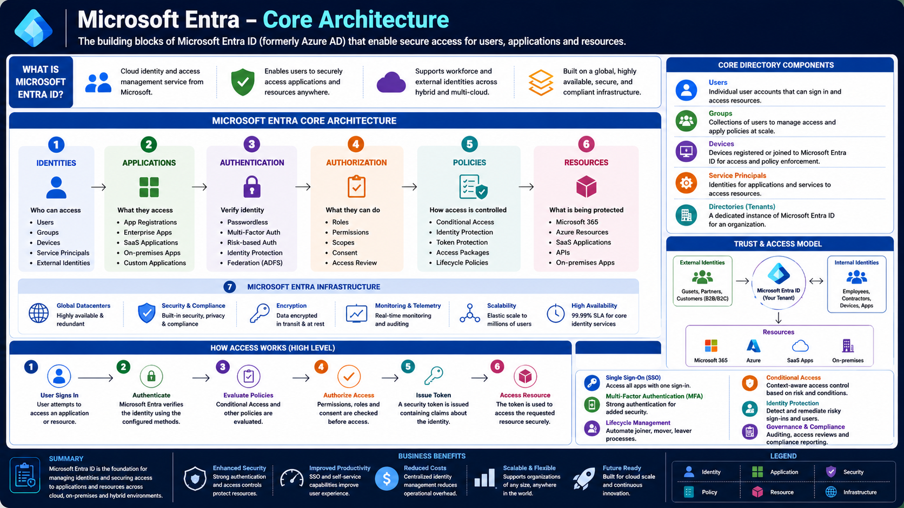

# Microsoft Entra – Core Architecture

Microsoft Entra ID is Microsoft's cloud-based Identity and Access Management (IAM) platform. It provides a centralized identity service that authenticates users, authorizes access to resources, and enforces security policies across cloud and on-premises environments.

After learning the fundamentals of digital identity, the next step is understanding how Microsoft Entra is structured internally. This architecture explains how identities, applications, policies, and resources work together to provide secure access.

---

# Architecture Diagram

The following diagram illustrates the complete Microsoft Entra Core Architecture.

---

# Learning Objectives

After completing this article, you will understand:

- The building blocks of Microsoft Entra
- How identities access applications
- Authentication and authorization flow
- Security policies
- Microsoft Entra infrastructure
- Core directory components
- Trust model
- High-level sign-in flow

---

# What is Microsoft Entra?

Microsoft Entra is Microsoft's cloud Identity and Access Management (IAM) platform.

It provides:

- Secure authentication
- Authorization
- Identity management
- Access management
- Security policy enforcement

Organizations use Microsoft Entra to securely access:

- Microsoft 365
- Azure
- SaaS applications
- On-premises applications
- Custom APIs

---

# Microsoft Entra Core Architecture

The architecture can be divided into six major components.

## 1. Identities

Everything begins with an identity.

Microsoft Entra manages multiple identity types:

- Users
- Groups
- Devices
- Service Principals
- External Identities

An identity represents anyone or anything requesting access to a resource.

---

## 2. Applications

Once an identity exists, it accesses an application.

Applications include:

- App Registrations
- Enterprise Applications
- SaaS Applications
- On-premises Applications
- Custom Applications

Applications trust Microsoft Entra to authenticate users instead of maintaining their own identity databases.

---

## 3. Authentication

Authentication verifies the identity requesting access.

Microsoft Entra supports multiple authentication methods including:

- Username and Password
- Multi-Factor Authentication (MFA)
- Passwordless Authentication
- Risk-Based Authentication
- Federation (ADFS)

Successful authentication results in Microsoft Entra issuing a security token.

---

## 4. Authorization

After authentication, Microsoft Entra determines what the authenticated identity is allowed to access.

Authorization evaluates:

- Roles
- Permissions
- OAuth Scopes
- User Consent
- Access Reviews

Only authorized users receive access to protected resources.

---

## 5. Policies

Policies provide centralized security controls.

Examples include:

- Conditional Access
- Identity Protection
- Token Protection
- Access Packages
- Lifecycle Policies

Policies are evaluated before access is granted.

---

## 6. Resources

The final destination is the protected resource.

Resources may include:

- Microsoft 365
- Azure Resources
- SaaS Applications
- APIs
- On-premises Applications

Applications validate the security token before granting access.

---

# Microsoft Entra Infrastructure

Microsoft Entra is built on Microsoft's globally distributed cloud infrastructure.

It provides:

- Global Datacenters
- Built-in Security & Compliance
- Encryption in transit and at rest
- Monitoring & Telemetry
- Elastic Scalability
- High Availability (99.99% SLA)

This infrastructure allows Microsoft Entra to authenticate millions of users every day.

---

# Core Directory Components

Every Microsoft Entra tenant contains several core components.

## Users

Individual accounts that sign in to applications.

Examples:

- Employees
- Administrators
- Contractors
- Guests

---

## Groups

Collections of users used for permission management.

Instead of assigning permissions individually, administrators assign permissions to groups.

---

## Devices

Registered or joined devices.

Examples include:

- Windows laptops
- macOS devices
- Mobile devices
- Servers

Device identities enable Conditional Access and compliance policies.

---

## Service Principals

A Service Principal represents an application's identity inside a tenant.

Applications use Service Principals to securely access APIs and Azure resources without requiring a user to sign in.

---

## Directory (Tenant)

A Tenant is an isolated Microsoft Entra directory.

Each organization has its own tenant containing:

- Users
- Groups
- Applications
- Devices
- Policies
- Service Principals

---

# Trust & Access Model

Microsoft Entra acts as the trusted identity provider between identities and enterprise resources.

It securely connects:

External Identities

↓

Microsoft Entra Tenant

↓

Internal Identities

↓

Protected Resources

Resources include:

- Microsoft 365
- Azure
- SaaS Applications
- On-premises Systems

---

# High-Level Authentication Flow

Every sign-in follows the same process.

### Step 1 – User Signs In

The user requests access to an application.

↓

### Step 2 – Authentication

Microsoft Entra verifies the user's identity.

↓

### Step 3 – Policy Evaluation

Conditional Access and security policies are evaluated.

↓

### Step 4 – Authorization

Permissions, scopes, and roles are checked.

↓

### Step 5 – Token Issued

Microsoft Entra issues a signed security token containing user claims.

↓

### Step 6 – Resource Access

The application validates the token and grants access to the requested resource.

---

# Security Features

Microsoft Entra includes several built-in security capabilities.

## Single Sign-On (SSO)

Authenticate once and access multiple applications.

## Multi-Factor Authentication (MFA)

Require additional verification beyond passwords.

## Conditional Access

Control access using user, device, location, and risk signals.

## Identity Protection

Detect risky users and suspicious sign-ins.

## Governance & Compliance

Manage access reviews, auditing, and compliance reporting.

---

# Business Benefits

Microsoft Entra provides several enterprise advantages.

- Enhanced Security
- Improved User Productivity
- Reduced Operational Costs
- Centralized Identity Management
- Global Scalability
- High Availability
- Cloud-Native Architecture
- Hybrid Identity Support

---

# Real-World Analogy

Think of Microsoft Entra as a secure airport.

- **Identity** → Passenger
- **Application** → Airline Check-in Counter
- **Authentication** → Passport Verification
- **Authorization** → Boarding Pass Validation
- **Policies** → Security Screening
- **Token** → Boarding Pass
- **Resources** → Airplane

Only passengers with valid identities, approved security checks, and authorized boarding passes can enter the aircraft.

Microsoft Entra follows the same principle for accessing enterprise resources.

---

# Summary

Microsoft Entra is built around six core components:

- Identities
- Applications
- Authentication
- Authorization
- Policies
- Resources

Together, these components provide secure identity management, centralized authentication, policy enforcement, and controlled access to enterprise applications and cloud resources.

Understanding this architecture provides the foundation for learning App Registrations, Service Principals, OAuth 2.0, OpenID Connect, JWTs, Microsoft Graph, and advanced enterprise authentication patterns.

---

# Key Takeaways

- Microsoft Entra is a cloud Identity and Access Management platform.
- Identities authenticate to applications through Microsoft Entra.
- Authentication verifies identity.
- Authorization determines permissions.
- Policies enforce organizational security.
- Service Principals represent applications.
- Tenants provide isolated identity directories.
- Security tokens enable secure access to protected resources.
