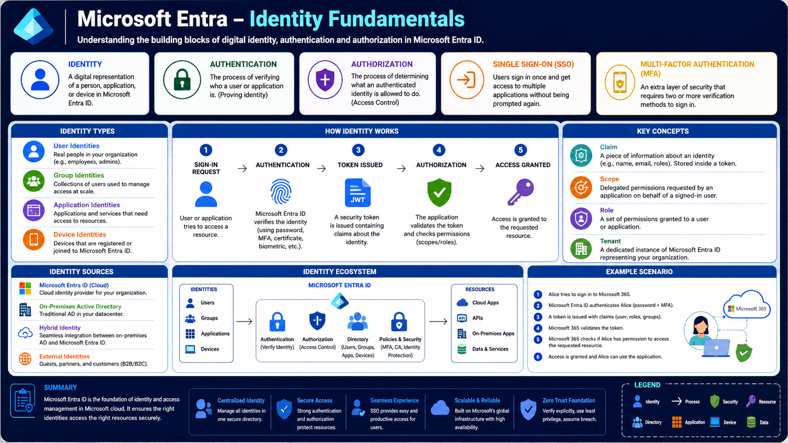

# Microsoft Entra – Identity Fundamentals

Microsoft Entra ID is Microsoft's cloud-based Identity and Access Management (IAM) platform. It enables organizations to securely manage users, applications, devices, and access to enterprise resources.

Every modern enterprise application relies on digital identities. Whether a user signs in to Microsoft 365, a developer accesses Azure, or an application communicates with another service, Microsoft Entra is responsible for verifying identities and controlling access.

Before learning OAuth 2.0, OpenID Connect, JWTs, App Registrations, or Microsoft Graph, it is important to understand the identity fundamentals. These concepts serve as the building blocks for every authentication and authorization flow discussed later in this learning path.

---

# Architecture Overview

The following diagram provides a high-level overview of the identity concepts covered in this article.



---

# What You'll Learn

In this article, you'll learn:

- What digital identity means
- Authentication vs Authorization
- Single Sign-On (SSO)
- Multi-Factor Authentication (MFA)
- Identity types
- Identity sources
- Microsoft Entra identity ecosystem
- Identity lifecycle
- Common identity terminology

---

# What Is Digital Identity?

A digital identity represents a person, application, service, or device within Microsoft Entra.

Every identity contains unique information that allows Microsoft Entra to verify who or what is requesting access to resources. Instead of applications storing user accounts independently, organizations centralize identity management within Microsoft Entra.

Examples of digital identities include:

- Employees
- Administrators
- Guest users
- Applications
- Services
- Registered devices

---

# Authentication vs Authorization

Although these terms are often used together, they solve different problems.

## Authentication

Authentication answers one question:

> **Who are you?**

Microsoft Entra verifies an identity using credentials such as:

- Username and Password
- Multi-Factor Authentication (MFA)
- Biometrics
- Certificates
- Security Keys

Once verification succeeds, Microsoft Entra issues a security token.

---

## Authorization

Authorization answers another question:

> **What are you allowed to do?**

Applications inspect the security token and determine which resources the authenticated identity is permitted to access.

Authentication always happens before authorization.

---

# Single Sign-On (SSO)

Without Single Sign-On, users would need to authenticate separately for every application they use.

Microsoft Entra allows users to authenticate once and securely access multiple trusted applications without repeatedly entering credentials.

Benefits of SSO include:

- Improved user experience
- Fewer passwords
- Reduced help desk requests
- Better security

---

# Multi-Factor Authentication (MFA)

Passwords alone are no longer sufficient for protecting enterprise accounts.

Microsoft Entra supports Multi-Factor Authentication by requiring an additional verification factor, such as:

- Microsoft Authenticator
- SMS verification
- Phone call
- Hardware security key
- Biometric authentication

Even if a password is compromised, MFA significantly reduces the likelihood of unauthorized access.

---

# Identity Types

Microsoft Entra manages several categories of identities.

## User Identities

Represent employees, administrators, contractors, or guest users who interact with enterprise applications.

---

## Group Identities

Groups simplify permission management by allowing administrators to assign permissions to collections of users instead of individual accounts.

---

## Application Identities

Applications and background services often require secure access to APIs and cloud resources without acting as a human user.

Microsoft Entra provides application identities specifically for these workloads.

---

## Device Identities

Computers, laptops, mobile devices, and servers can be registered with Microsoft Entra.

Device identities enable security features such as Conditional Access and device compliance policies.

---

# Identity Sources

Organizations commonly manage identities from multiple sources.

## Microsoft Entra ID

Cloud-native identities managed entirely within Microsoft Entra.

---

## On-Premises Active Directory

Traditional Windows Active Directory running inside an organization's datacenter.

---

## Hybrid Identity

Many organizations synchronize identities between Active Directory and Microsoft Entra, allowing users to access both cloud and on-premises resources using the same account.

---

## External Identities

Microsoft Entra also supports external users, partners, vendors, and customers through Business-to-Business (B2B) and Business-to-Consumer (B2C) capabilities.

---

# Identity Lifecycle

Every successful sign-in follows a similar sequence.

```text
Sign-in Request
        ↓
Authentication
        ↓
Security Token Issued
        ↓
Authorization
        ↓
Access Granted
```

During this process:

1. A user or application requests access.
2. Microsoft Entra verifies the identity.
3. A security token is issued.
4. The application validates the token.
5. Permissions are evaluated.
6. Access is granted or denied.

---

# Microsoft Entra Identity Ecosystem

Microsoft Entra serves as the central identity platform connecting identities with enterprise resources.

It manages:

- Users
- Groups
- Applications
- Devices

It also provides:

- Authentication
- Authorization
- Identity Directory
- Security Policies
- Conditional Access
- Multi-Factor Authentication

These services enable secure access to:

- Cloud Applications
- APIs
- Microsoft 365
- Azure Resources
- On-Premises Applications
- Enterprise Services

---

# Key Concepts

## Claim

A claim is a piece of information stored inside a security token.

Examples include:

- User Name
- Email Address
- Object ID
- Tenant ID
- Roles

---

## Scope

A scope represents a delegated permission granted to an application on behalf of a signed-in user.

Example:

- User.Read
- Patient.Read
- Files.Read

---

## Role

Roles define what a user or application is allowed to do inside an organization or application.

---

## Tenant

A tenant is a dedicated Microsoft Entra directory that represents an organization.

Every organization has its own isolated tenant containing users, groups, applications, and security policies.

---

# Real-World Analogy

Imagine entering a secure office building.

- You are the **User**.
- The receptionist is **Microsoft Entra**.
- Your employee badge is the **Access Token**.
- Security guards verify your badge before allowing entry.
- Different office rooms represent applications and APIs.
- Your badge determines which rooms you can enter.

Microsoft Entra works in the same way. It first verifies your identity and then determines which resources you are authorized to access.

---

# Summary

Microsoft Entra provides the foundation for identity and access management in modern enterprise environments.

It centralizes identity management, verifies users and applications, issues security tokens, and controls access to enterprise resources.

Understanding these concepts makes it significantly easier to learn OAuth 2.0, OpenID Connect, JWTs, App Registrations, Microsoft Graph, and the complete enterprise authentication architecture covered later in this learning path.

---

# Key Takeaways

- Microsoft Entra is Microsoft's cloud identity platform.
- Authentication verifies identity.
- Authorization controls access.
- Digital identities include users, applications, groups, and devices.
- SSO improves user experience.
- MFA strengthens security.
- Tokens carry identity information between applications.
- Microsoft Entra centralizes enterprise identity management.
