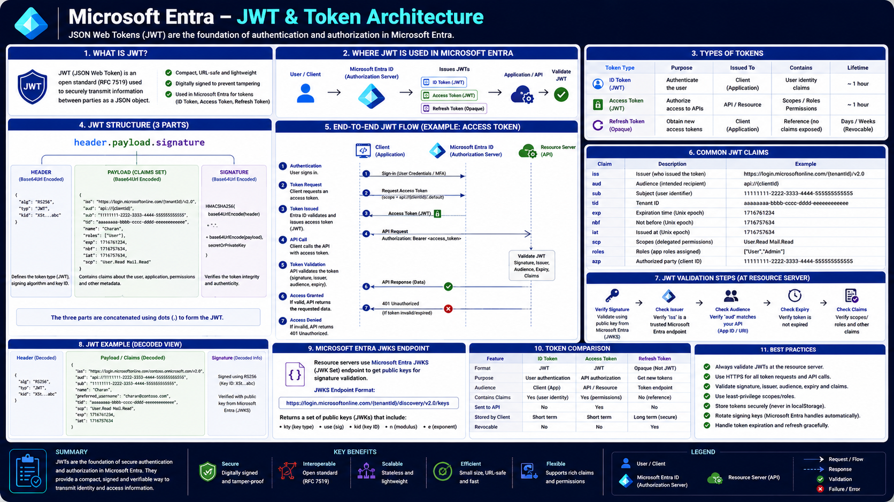

# Microsoft Entra – JWT Token Architecture

When a user or application successfully authenticates with Microsoft Entra, it receives a **JSON Web Token (JWT)** — a compact, self-contained token that carries information about the authenticated identity and what it is allowed to do.

Applications and APIs read this token to determine who is calling and what permissions they hold, without needing to contact Microsoft Entra on every single request.

---

# Architecture Diagram



---

# Learning Objectives

After completing this article, you will understand:

- What a JWT is and why Microsoft Entra uses them
- The three-part structure of a JWT
- What information lives in the header
- What information lives in the payload
- Common claims issued by Microsoft Entra
- The difference between ID Tokens and Access Tokens
- Why the signature matters (covered in depth in the next article)

---

# What Is a JWT?

A JWT is a URL-safe string that encodes a set of claims about an authenticated identity. It is:

- **Compact** — small enough to pass in an HTTP header, URL, or cookie.
- **Self-contained** — carries all the claims an API needs, without a database lookup.
- **Verifiable** — cryptographically signed so a recipient can confirm it hasn't been tampered with.

Microsoft Entra issues JWTs for both **ID Tokens** (proving who the user is) and **Access Tokens** (proving what the caller is authorized to do).

---

# JWT Structure

Every JWT consists of three Base64URL-encoded sections separated by periods:

```text
Header.Payload.Signature
```

Example:

```text
eyJhbGciOiJSUzI1NiIsImtpZCI6IlhTVGUifQ.
eyJpc3MiOiJodHRwczovL2xvZ2luLm1pY3Jvc29mdG9ubGluZS5jb20ifQ.
QbJ83eA...
```

| Section   | Purpose                                              |
| --------- | ---------------------------------------------------- |
| Header    | Metadata describing the token                        |
| Payload   | Identity and permission claims                       |
| Signature | Proves the token is authentic (see the next article) |

---

# JWT Header

The header describes how the token was signed.

```json
{
  "alg": "RS256",
  "typ": "JWT",
  "kid": "x5teabc123"
}
```

| Field | Description                           |
| ----- | ------------------------------------- |
| alg   | Signing algorithm (`RS256`)           |
| typ   | Token type (`JWT`)                    |
| kid   | Identifies which signing key was used |

The `kid` value matters during verification — it tells the recipient exactly which Microsoft Entra public key to use, a detail explored fully in the next article.

---

# JWT Payload

The payload contains the actual claims — the information the token is carrying.

```json
{
  "iss": "https://login.microsoftonline.com/{tenant}/v2.0",
  "sub": "11111111-2222-3333-4444-555555555555",
  "aud": "api://contoso-api",
  "tid": "{tenant-id}",
  "oid": "{object-id}",
  "exp": 1716761254,
  "iat": 1716757654,
  "scp": "User.Read",
  "name": "Charan"
}
```

## Common Claims

| Claim   | Description                                                 |
| ------- | ----------------------------------------------------------- |
| `iss`   | Issuer — the Microsoft Entra tenant that issued the token   |
| `sub`   | Subject — a stable identifier for the authenticated user    |
| `aud`   | Audience — the application or API the token is intended for |
| `tid`   | Tenant ID                                                   |
| `oid`   | Object ID of the user in the directory                      |
| `exp`   | Expiration time                                             |
| `iat`   | Issued-at time                                              |
| `scp`   | Delegated permissions (scopes) granted to the caller        |
| `roles` | Application roles assigned to the caller                    |

The payload is **encoded, not encrypted** — anyone holding the token can decode and read it. Sensitive information should never be placed inside JWT claims.

---

# ID Tokens vs Access Tokens

Microsoft Entra issues two distinct kinds of JWTs during authentication:

| Token Type   | Purpose                                              | Consumed By            |
| ------------ | ---------------------------------------------------- | ---------------------- |
| ID Token     | Proves the user's identity to the client application | The client application |
| Access Token | Authorizes the caller to access a specific API       | The resource API       |

An ID Token answers "who signed in?" for the application itself. An Access Token answers "is this caller allowed to do this?" for whichever API receives it.

---

# Why the Signature Matters

Because the payload is only encoded, nothing so far stops an attacker from modifying a claim — unless the token is also **signed**.

Microsoft Entra digitally signs every JWT it issues, and every API that receives one must verify that signature before trusting any of its claims. That signing and verification process — SHA-256 hashing, RSA public/private keys, JWKS, and key rotation — is the subject of the next article, **Cryptography Deep Dive**.

---

# Summary

A JWT is a compact, self-contained token made of a header, payload, and signature. Microsoft Entra uses JWTs for both ID Tokens and Access Tokens, encoding claims such as issuer, subject, audience, expiration, and granted scopes directly into the token. The payload can be read by anyone who holds the token, which is why the signature — covered next — is what makes the token trustworthy.

---

# Key Takeaways

- A JWT has three parts: header, payload, and signature.
- The header identifies the signing algorithm and key (`kid`).
- The payload carries claims like `iss`, `sub`, `aud`, `exp`, and `scp`.
- JWT payloads are encoded, not encrypted — never store secrets in claims.
- ID Tokens identify the user; Access Tokens authorize API calls.
- Trusting a JWT's claims requires verifying its signature, covered in the next article.
