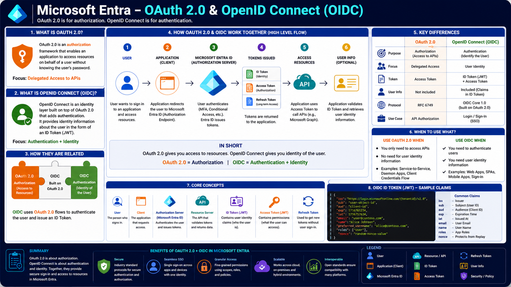

# Microsoft Entra – OAuth 2.0 & OpenID Connect (OIDC)

Modern applications rarely store usernames and passwords themselves. Instead, they rely on an Identity Provider such as Microsoft Entra ID to authenticate users and securely grant access to protected resources.

Microsoft Entra implements **OAuth 2.0** for authorization and **OpenID Connect (OIDC)** for authentication. Although they are closely related and often used together, they solve different problems.

- **OAuth 2.0** answers **"What can this application access?"**
- **OpenID Connect (OIDC)** answers **"Who is the user?"**

Together they enable secure sign-in, Single Sign-On (SSO), and token-based access to APIs.

---

# Architecture Diagram

The following diagram illustrates how OAuth 2.0 and OpenID Connect work together in Microsoft Entra.

---

# Learning Objectives

After completing this article, you will understand:

- What OAuth 2.0 is
- What OpenID Connect (OIDC) is
- Why OIDC is built on OAuth 2.0
- Authentication vs Authorization
- OAuth 2.0 roles
- OAuth tokens
- ID Token vs Access Token vs Refresh Token
- Complete authentication flow
- OAuth vs OIDC differences
- When to use each protocol

---

# Why Do We Need OAuth 2.0?

Before OAuth 2.0, applications often requested a user's username and password directly.

This approach had several drawbacks:

- Applications stored user passwords.
- Password reuse increased security risks.
- Users had no fine-grained control over application permissions.

OAuth 2.0 solves this problem by allowing applications to request **access tokens** instead of user credentials.

The application never sees or stores the user's password.

---

# What is OAuth 2.0?

OAuth 2.0 is an **authorization framework**.

It allows an application to access protected resources on behalf of a user without exposing the user's credentials.

Its primary purpose is:

- Delegated access to APIs
- Secure authorization
- Token-based access

OAuth itself does **not** identify the user.

Instead, it grants permission to access resources.

---

# What is OpenID Connect (OIDC)?

OpenID Connect (OIDC) is an identity layer built on top of OAuth 2.0.

It extends OAuth by adding user authentication.

OIDC introduces the **ID Token**, which contains information about the authenticated user.

Applications use this token to determine:

- Who signed in
- User name
- Email
- Roles
- Other identity claims

---

# How OAuth 2.0 and OIDC Work Together

OAuth and OIDC are commonly used together in modern applications.

The overall flow is:

1. A user opens an application.
2. The application redirects the user to Microsoft Entra ID.
3. Microsoft Entra authenticates the user.
4. Microsoft Entra issues tokens.
5. The application uses the Access Token to call APIs.
6. The application uses the ID Token to identify the signed-in user.

Together they provide both:

- Authentication
- Authorization

---

# Authentication Flow

The authentication process follows these steps.

## Step 1 – User

The user attempts to access an application.

---

## Step 2 – Application (Client)

The application redirects the user to Microsoft Entra's Authorization Endpoint.

---

## Step 3 – Microsoft Entra ID

Microsoft Entra authenticates the user.

Authentication may include:

- Password
- Multi-Factor Authentication (MFA)
- Conditional Access
- Passwordless Authentication

---

## Step 4 – Tokens Issued

After successful authentication, Microsoft Entra issues one or more tokens.

Depending on the flow, these include:

- ID Token
- Access Token
- Refresh Token

---

## Step 5 – Access Protected Resources

The application sends the Access Token to a protected API.

Examples include:

- Microsoft Graph
- Azure APIs
- Custom APIs

The API validates the Access Token before returning data.

---

## Step 6 – User Information

The application validates the ID Token to determine the user's identity.

If additional profile information is needed, the application can retrieve it from Microsoft Graph or the UserInfo endpoint.

---

# OAuth 2.0 Roles

OAuth defines several participants.

## User (Resource Owner)

The person who owns the protected resources.

---

## Client

The application requesting access.

Examples:

- Web applications
- Mobile applications
- Single Page Applications (SPAs)

---

## Authorization Server

Microsoft Entra ID acts as the Authorization Server.

Its responsibilities include:

- Authenticating users
- Issuing tokens
- Validating client applications

---

## Resource Server

The API that hosts protected resources.

Examples:

- Microsoft Graph
- Azure Resource Manager
- Custom Web APIs

---

# OAuth Tokens

Microsoft Entra issues different tokens depending on the scenario.

## ID Token

Purpose:

Identify the authenticated user.

Contains claims such as:

- User ID
- Name
- Email
- Tenant ID
- Roles

Applications use the ID Token for authentication.

---

## Access Token

Purpose:

Authorize access to protected APIs.

Contains:

- Permissions
- Scopes
- Audience
- Expiration

Applications send the Access Token with every API request.

---

## Refresh Token

Purpose:

Obtain new Access Tokens without requiring the user to sign in again.

Refresh Tokens improve user experience by enabling long-lived sessions.

---

# OAuth 2.0 vs OpenID Connect

| OAuth 2.0                  | OpenID Connect (OIDC)             |
| -------------------------- | --------------------------------- |
| Authorization              | Authentication                    |
| Access to APIs             | User Sign-in                      |
| Returns Access Token       | Returns ID Token (+ Access Token) |
| Does not identify the user | Identifies the authenticated user |
| RFC 6749                   | Built on OAuth 2.0                |

---

# When Should You Use OAuth 2.0?

Use OAuth 2.0 when your application needs to:

- Access Microsoft Graph
- Call Azure APIs
- Access custom APIs
- Perform delegated authorization
- Use application permissions

Examples:

- Background services
- Daemon applications
- API integrations
- Microservices

---

# When Should You Use OpenID Connect?

Use OpenID Connect when your application needs:

- User sign-in
- Single Sign-On (SSO)
- User identity
- Profile information

Examples:

- Web applications
- Single Page Applications
- Mobile applications
- Enterprise portals

---

# ID Token (JWT)

The ID Token is a JSON Web Token (JWT).

It contains identity claims such as:

- Issuer (`iss`)
- Subject (`sub`)
- Audience (`aud`)
- Expiration (`exp`)
- Email
- Name
- Roles
- Nonce

Applications validate the token before trusting the user's identity.

---

# Benefits of OAuth 2.0 & OIDC

Microsoft Entra provides several benefits through OAuth 2.0 and OpenID Connect.

- Secure authentication
- Secure authorization
- Single Sign-On (SSO)
- Token-based security
- Fine-grained permissions
- Cloud-native architecture
- Cross-platform compatibility
- Scalable identity management

---

# Real-World Example

Imagine an employee signs in to a company portal.

1. The employee opens the application.
2. The application redirects the employee to Microsoft Entra.
3. Microsoft Entra authenticates the employee using MFA.
4. Microsoft Entra issues:
   - ID Token
   - Access Token
   - Refresh Token
5. The application uses the ID Token to display the employee's profile.
6. The application uses the Access Token to retrieve user information from Microsoft Graph.
7. When the Access Token expires, the Refresh Token obtains a new one without requiring another sign-in.

---

# Summary

OAuth 2.0 and OpenID Connect work together to provide secure authentication and authorization in Microsoft Entra.

OAuth 2.0 grants applications permission to access protected resources, while OpenID Connect identifies the authenticated user through an ID Token.

Together they power secure sign-in, Single Sign-On, API access, and modern cloud-native applications.

---

# Key Takeaways

- OAuth 2.0 is an authorization framework.
- OpenID Connect is an authentication protocol built on OAuth 2.0.
- OAuth grants access to APIs.
- OIDC identifies authenticated users.
- Microsoft Entra acts as the Authorization Server.
- ID Tokens identify users.
- Access Tokens authorize API access.
- Refresh Tokens renew sessions without requiring users to sign in again.
