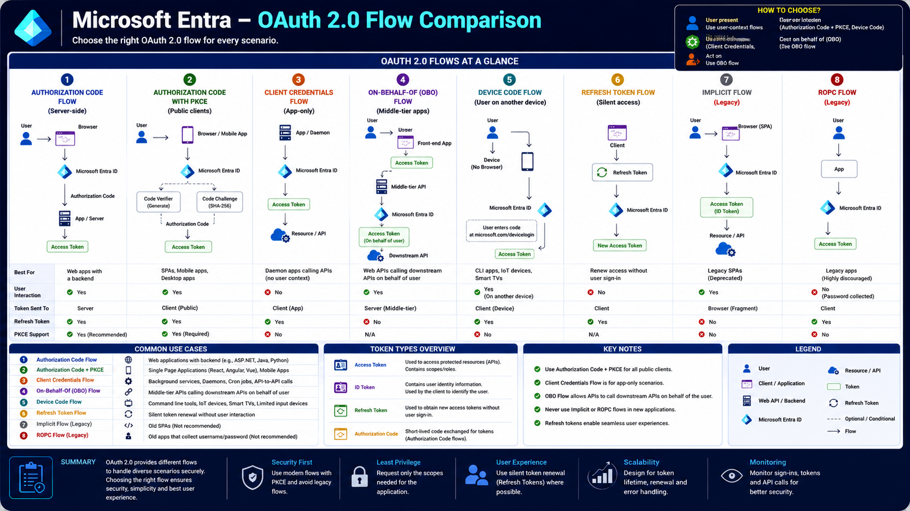

# Microsoft Entra – OAuth 2.0 Flow Comparison

OAuth 2.0 provides multiple authorization flows because different application types have different security requirements. A web application running on a secure server does not authenticate the same way as a mobile app, a daemon service, or an IoT device.

Microsoft Entra supports several OAuth 2.0 flows, each designed for a specific scenario. Choosing the correct flow improves security, simplifies development, and provides the best user experience.

This article compares all major OAuth 2.0 flows and explains when each one should be used.

---

# Architecture Diagram

The following diagram compares the OAuth 2.0 authorization flows available in Microsoft Entra.

---

# Learning Objectives

After completing this article, you will understand:

- Why OAuth 2.0 has multiple flows
- Authorization Code Flow
- Authorization Code with PKCE
- Client Credentials Flow
- On-Behalf-Of (OBO) Flow
- Device Code Flow
- Refresh Token Flow
- Implicit Flow (Legacy)
- Resource Owner Password Credentials (ROPC) Flow (Legacy)
- Which flow should be used for different application types

---

# Why Are There Multiple OAuth Flows?

Different applications operate in different environments.

For example:

- A web application can securely store secrets.
- A mobile application cannot.
- A background service runs without users.
- A smart TV has no browser.
- An API may need to call another API on behalf of a user.

Because of these differences, OAuth defines multiple authorization flows instead of a single authentication process.

---

# 1. Authorization Code Flow

The Authorization Code Flow is the standard OAuth flow for **confidential client applications** such as traditional web applications.

## How It Works

1. User signs in.
2. Browser redirects to Microsoft Entra.
3. Microsoft Entra authenticates the user.
4. An Authorization Code is returned.
5. The backend exchanges the code for an Access Token.
6. The application calls protected APIs.

## Best For

- ASP.NET applications
- Java applications
- Python web applications
- Server-rendered web applications

## Advantages

- Most secure server-side flow
- Supports Refresh Tokens
- Backend keeps secrets secure

---

# 2. Authorization Code Flow with PKCE

PKCE (Proof Key for Code Exchange) extends the Authorization Code Flow by protecting public clients that cannot safely store secrets.

A Code Verifier and Code Challenge prevent authorization code interception attacks.

## Best For

- Single Page Applications (SPA)
- Mobile Apps
- Desktop Applications

## Advantages

- No Client Secret required
- Recommended by Microsoft
- Protects public clients
- Supports Refresh Tokens

> **Recommendation:** Use Authorization Code + PKCE for all new public client applications.

---

# 3. Client Credentials Flow

The Client Credentials Flow is used when an application needs to authenticate **without a signed-in user**.

The application authenticates itself using:

- Client Secret
- Certificate
- Federated Credential

Microsoft Entra issues an Access Token directly.

## Best For

- Daemon Applications
- Scheduled Jobs
- Background Services
- Microservices
- Server-to-Server Communication

## Characteristics

- No user interaction
- No ID Token
- Uses Application Permissions

---

# 4. On-Behalf-Of (OBO) Flow

The On-Behalf-Of Flow allows one API to call another API while preserving the user's identity.

Instead of using its own permissions, the middle-tier API exchanges the user's Access Token for another Access Token.

## Flow

User

↓

Frontend Application

↓

Web API

↓

Microsoft Entra

↓

New Access Token

↓

Downstream API

## Best For

- Multi-tier applications
- API chaining
- Microsoft Graph from backend APIs

---

# 5. Device Code Flow

Some devices do not have a browser or keyboard.

Examples include:

- Smart TVs
- IoT Devices
- CLI Applications
- Embedded Devices

The Device Code Flow solves this problem.

## How It Works

1. Device displays a code.
2. User opens **https://microsoft.com/devicelogin**.
3. User enters the code.
4. Microsoft Entra authenticates the user.
5. Device receives an Access Token.

## Best For

- Azure CLI
- PowerShell
- Smart TVs
- IoT Devices

---

# 6. Refresh Token Flow

Access Tokens are intentionally short-lived.

Instead of asking users to sign in repeatedly, Microsoft Entra issues a Refresh Token.

The application exchanges the Refresh Token for a new Access Token whenever the old one expires.

## Benefits

- Silent authentication
- Better user experience
- Reduced sign-in prompts

---

# 7. Implicit Flow (Legacy)

The Implicit Flow was originally designed for browser applications.

Microsoft now recommends **not using it** for new applications.

Reasons include:

- Tokens exposed in browser URLs
- No Refresh Tokens
- Lower security than Authorization Code + PKCE

## Status

**Deprecated for new applications**

---

# 8. Resource Owner Password Credentials (ROPC) Flow (Legacy)

The ROPC Flow allows applications to collect usernames and passwords directly.

This approach is strongly discouraged.

Problems include:

- Application receives user passwords
- No MFA support
- Limited Conditional Access support
- Poor security

## Status

**Do not use for new applications.**

---

# Token Types Used Across OAuth Flows

OAuth uses several token types depending on the selected flow.

## Authorization Code

A temporary code exchanged for tokens.

---

## Access Token

Used to access protected APIs.

Contains:

- Scopes
- Permissions
- Audience
- Expiration

---

## ID Token

Returned when OpenID Connect is used.

Contains:

- User identity
- Claims
- Roles
- Tenant information

---

## Refresh Token

Used to obtain new Access Tokens without requiring another sign-in.

---

# Choosing the Right Flow

Choose your OAuth flow based on your application type.

| Scenario                    | Recommended Flow          |
| --------------------------- | ------------------------- |
| Web Application             | Authorization Code        |
| SPA                         | Authorization Code + PKCE |
| Mobile App                  | Authorization Code + PKCE |
| Desktop App                 | Authorization Code + PKCE |
| Background Service          | Client Credentials        |
| Web API calling another API | On-Behalf-Of              |
| CLI Tool                    | Device Code               |
| Smart TV                    | Device Code               |
| Token Renewal               | Refresh Token             |

Avoid:

- Implicit Flow
- ROPC Flow

These are considered legacy flows.

---

# Best Practices

When building new applications:

- Use Authorization Code + PKCE for all public clients.
- Use Client Credentials only for app-only scenarios.
- Use OBO when an API calls another API.
- Use Device Code for devices without browsers.
- Use Refresh Tokens for seamless user experiences.
- Avoid legacy flows unless absolutely necessary.

---

# Real-World Examples

| Application                         | OAuth Flow                |
| ----------------------------------- | ------------------------- |
| ASP.NET MVC Website                 | Authorization Code        |
| React SPA                           | Authorization Code + PKCE |
| Mobile Banking App                  | Authorization Code + PKCE |
| Azure Function                      | Client Credentials        |
| Microsoft Graph Background Sync     | Client Credentials        |
| Azure CLI                           | Device Code               |
| API Gateway calling Microsoft Graph | On-Behalf-Of              |
| Smart TV                            | Device Code               |

---

# Summary

OAuth 2.0 provides multiple authorization flows because different application types have different authentication requirements.

Modern applications should use secure, standards-based flows such as Authorization Code with PKCE, Client Credentials, and On-Behalf-Of. Legacy flows such as Implicit and ROPC should be avoided in new applications.

Choosing the correct flow ensures secure authentication, proper authorization, and a better user experience.

---

# Key Takeaways

- OAuth provides multiple flows for different application types.
- Authorization Code is the standard flow for server-side applications.
- Authorization Code + PKCE is recommended for SPAs, mobile, and desktop apps.
- Client Credentials is used for application-to-application authentication.
- OBO allows APIs to call downstream APIs on behalf of users.
- Device Code supports devices without browsers.
- Refresh Tokens provide silent token renewal.
- Avoid Implicit and ROPC for new applications.
