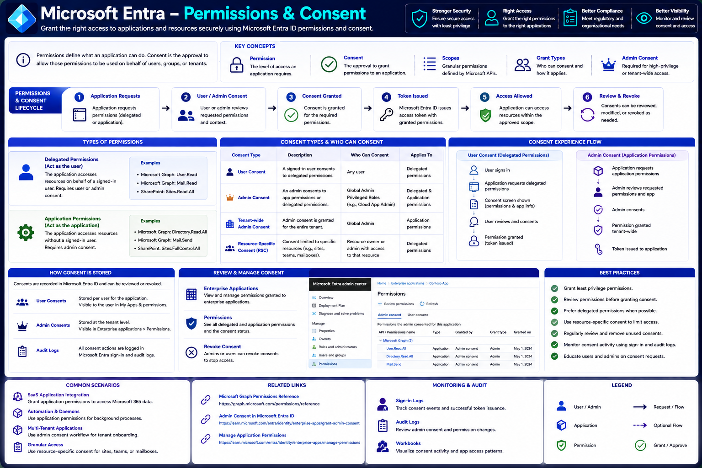

# Microsoft Entra – Permissions & Consent

Permissions determine **what an application is allowed to do**, while consent determines **who authorizes those permissions**.

Whenever an application requests access to Microsoft Graph, Microsoft Entra ID, or another protected API, Microsoft Entra evaluates the requested permissions and ensures that the appropriate user or administrator has approved them before issuing an Access Token.

Understanding permissions and consent is essential for building secure applications that follow the principle of least privilege and comply with organizational security requirements.

---

# Architecture Diagram



---

# Learning Objectives

After completing this article, you will understand:

- What permissions are
- What consent is
- Delegated permissions
- Application permissions
- Scopes
- User consent
- Administrator consent
- Tenant-wide consent
- Resource-specific consent (RSC)
- Permission lifecycle
- Consent storage
- Reviewing and revoking consent
- Best practices

---

# Understanding Permissions

A **permission** defines the level of access an application requests to a protected resource.

Permissions determine **what actions** an application can perform after Microsoft Entra issues an Access Token.

For example, an application may request permission to:

- Read a user's profile
- Read mail
- Send email
- Manage groups
- Read directory data
- Manage devices

Microsoft Entra evaluates these permissions before granting access.

---

# What is Consent?

**Consent** is the approval that allows an application to use the requested permissions.

Depending on the permission type, consent may be granted by:

- The signed-in user
- A Global Administrator
- Another privileged administrator
- A resource owner (for specific resources)

Only after the required consent is granted can Microsoft Entra issue an Access Token containing the approved permissions.

---

# Key Concepts

Several concepts are central to the Microsoft Entra permission model.

## Permissions

Define what an application can access.

Examples include:

- User.Read
- Mail.Read
- Group.Read.All
- Directory.Read.All

---

## Consent

Approves the requested permissions.

Without consent, the requested permissions cannot be used.

---

## Scopes

Scopes define granular delegated permissions exposed by an API.

Examples include:

```text
User.Read

Mail.Read

Calendars.Read

Files.Read
```

Applications request scopes during authentication.

---

## Grant Types

Grant types determine how permissions are granted and who is responsible for approving them.

Examples include:

- User Consent
- Admin Consent
- Resource-Specific Consent (RSC)

---

## Admin Consent

Some permissions provide organization-wide access and therefore require administrator approval.

These permissions cannot be approved by standard users.

---

# Permissions & Consent Lifecycle

Every permission request follows a predictable lifecycle.

## Step 1 – Application Requests Permissions

The application requests one or more permissions.

Examples:

- Delegated permissions
- Application permissions

The request is typically included during the OAuth authentication flow.

---

## Step 2 – User or Administrator Reviews the Request

Microsoft Entra displays a consent screen describing:

- Application name
- Publisher
- Requested permissions
- Permission descriptions

The user or administrator reviews the requested access before making a decision.

---

## Step 3 – Consent Granted

If approved:

- Consent is recorded.
- Microsoft Entra stores the approval.
- The application is authorized to use the approved permissions.

If consent is denied, authentication continues without the requested permissions or fails, depending on the application's requirements.

---

## Step 4 – Access Token Issued

Microsoft Entra issues an Access Token containing the approved scopes or application roles.

Example delegated scope:

```text
scp:
User.Read Mail.Read
```

Example application role:

```text
roles:
Directory.Read.All
```

The token now represents the permissions that have been granted.

---

## Step 5 – Access Allowed

The application calls Microsoft Graph or another protected API using the Access Token.

The resource validates:

- Token signature
- Issuer
- Audience
- Expiration
- Approved scopes or roles

Only the approved permissions can be used.

---

## Step 6 – Review and Revoke

Permissions are not permanent.

Users and administrators can later:

- Review granted permissions
- Remove permissions
- Revoke consent
- Disable applications

Revoking consent immediately prevents future tokens from containing those permissions.

---

# Types of Permissions

Microsoft Entra supports two primary permission models.

## Delegated Permissions

Delegated permissions allow an application to act **on behalf of a signed-in user**.

The application's effective permissions are limited by:

- The permissions granted to the application.
- The permissions that the signed-in user already has.

Examples include:

- `User.Read`
- `Mail.Read`
- `Calendars.Read`
- `Sites.Read.All`

Delegated permissions are commonly used by:

- Web applications
- Single Page Applications (SPAs)
- Mobile applications
- Desktop applications

---

## Application Permissions

Application permissions allow an application to act **as itself**, without a signed-in user.

These permissions are typically used by:

- Background services
- Scheduled jobs
- Automation scripts
- Daemons
- Integration platforms

Because application permissions often provide broad access across an entire tenant, they usually require administrator consent.

Examples include:

- `Directory.Read.All`
- `Mail.Send`
- `Sites.FullControl.All`

---

# Consent Types

Microsoft Entra supports several consent models depending on the type of permission requested and the resources being accessed.

## User Consent

User Consent allows a signed-in user to approve **delegated permissions** for an application.

This is the most common consent experience for applications that access data on behalf of the current user.

Typical workflow:

```text
User Signs In

↓

Application Requests Delegated Permissions

↓

Consent Screen Displayed

↓

User Approves

↓

Access Token Issued
```

Examples of delegated permissions include:

- `User.Read`
- `Mail.Read`
- `Calendars.Read`
- `Files.Read`

A user can only consent to permissions that organizational policies allow.

---

## Administrator Consent

Some permissions grant access beyond an individual user's data and therefore require approval from an administrator.

Administrator consent is required for:

- High-privilege Microsoft Graph permissions
- Tenant-wide access
- Application permissions
- Sensitive delegated permissions

Only privileged Microsoft Entra roles can grant administrator consent.

Examples include:

- Global Administrator
- Cloud Application Administrator
- Privileged Role Administrator (depending on the permission)

Example permissions requiring admin consent:

- `Directory.Read.All`
- `User.Read.All`
- `Group.ReadWrite.All`

---

## Tenant-Wide Administrator Consent

Tenant-wide consent allows an administrator to approve permissions once for the entire Microsoft Entra tenant.

Benefits include:

- Users are not prompted individually.
- Consistent application behavior across the organization.
- Simplified application deployment.

Typical workflow:

```text
Application Requests Permissions

↓

Administrator Reviews Request

↓

Tenant-Wide Consent Granted

↓

All Authorized Users Can Use the Application
```

This model is commonly used for enterprise applications deployed organization-wide.

---

## Resource-Specific Consent (RSC)

Resource-Specific Consent (RSC) enables permissions to be granted for a specific resource rather than the entire tenant.

Examples include:

- A Microsoft Teams team
- A SharePoint site
- A specific mailbox

This approach limits the application's access to only the approved resource.

Benefits include:

- Reduced security risk
- Least-privilege access
- Better isolation between resources

---

# Consent Experience Flow

The consent experience differs depending on the permission type.

## User Consent Flow

For delegated permissions:

```text
User Signs In

↓

Application Requests Scopes

↓

Consent Screen Displayed

↓

User Reviews Requested Permissions

↓

User Selects Accept

↓

Microsoft Entra Records Consent

↓

Access Token Issued
```

The issued Access Token contains only the scopes that were approved.

---

## Administrator Consent Flow

For application permissions or high-privilege delegated permissions:

```text
Application Requests Permissions

↓

Administrator Signs In

↓

Administrator Reviews Requested Permissions

↓

Administrator Grants Consent

↓

Tenant Consent Stored

↓

Access Token Issued
```

After administrator consent has been granted, users typically are not prompted again for those permissions.

---

# How Consent Is Stored

Microsoft Entra stores consent decisions so that users and administrators are not repeatedly prompted.

## User Consent

User consent is stored for the individual user.

Characteristics:

- Applies only to that user.
- Can be reviewed by the user.
- Can be revoked later.
- Does not affect other users.

---

## Administrator Consent

Administrator consent is stored at the tenant level.

Characteristics:

- Applies across the organization.
- Available to authorized users.
- Managed by administrators.
- Can be revoked centrally.

---

## Audit Logs

Every consent-related action can be recorded in Microsoft Entra audit logs.

Examples include:

- Consent granted
- Consent revoked
- Permission changes
- Application updates

Audit logs support compliance, troubleshooting, and security investigations.

---

# Reviewing and Managing Consent

Administrators should periodically review application permissions to ensure they remain appropriate.

Microsoft Entra provides centralized management through the **Enterprise Applications** blade.

Administrators can:

- View granted permissions
- Review delegated permissions
- Review application permissions
- Verify administrator consent
- Identify unused applications

Regular reviews help maintain a secure environment.

---

## Enterprise Applications

The Enterprise Applications section provides visibility into applications that have been granted access within the tenant.

Administrators can:

- Review application details
- Inspect assigned permissions
- Manage user assignments
- Configure sign-in settings
- Monitor consent history

This is typically the first place administrators go when auditing application access.

---

## Viewing Permissions

For each enterprise application, Microsoft Entra displays:

- Microsoft Graph permissions
- Custom API permissions
- Delegated permissions
- Application permissions
- Grant type
- Consent status
- Date granted

This information helps administrators understand exactly what access an application has.

---

## Revoking Consent

If an application no longer requires access—or is no longer trusted—consent can be revoked.

Revoking consent:

- Prevents new Access Tokens from including the revoked permissions.
- Stops future API access based on those permissions.
- May require users or administrators to grant consent again if the application is reused.

Revocation is an important part of the application lifecycle and supports the principle of least privilege.

---

# Common Scenarios

Microsoft Entra permissions and consent support a variety of application architectures and enterprise scenarios.

## SaaS Application Integration

Software-as-a-Service (SaaS) applications often require access to Microsoft 365 and Microsoft Entra resources.

Typical examples include:

- Reading user profiles
- Synchronizing users and groups
- Accessing calendars
- Sending email
- Managing Teams resources

Most SaaS applications use delegated permissions initially, while administrative features may require administrator consent.

---

## Background Automation

Background services and daemon applications operate without user interaction.

These applications commonly use:

- Application permissions
- Client Credentials Flow

Typical scenarios include:

- Scheduled reporting
- User provisioning
- License management
- Directory synchronization
- Security monitoring

Because these applications can access organizational resources independently, administrator consent is required.

---

## Multi-Tenant Applications

Applications that support multiple organizations must request consent separately from each tenant.

Typical onboarding process:

```text
Customer Signs In

↓

Application Requests Permissions

↓

Tenant Administrator Reviews Request

↓

Administrator Grants Consent

↓

Application Can Access Customer Tenant
```

Each Microsoft Entra tenant independently controls whether the application is trusted and what permissions it receives.

---

## Granular Access with Resource-Specific Consent (RSC)

Some Microsoft 365 workloads support **Resource-Specific Consent (RSC)**, allowing administrators or resource owners to grant permissions for a specific resource instead of the entire tenant.

Examples include:

- A Microsoft Teams team
- A SharePoint site
- A Shared Mailbox

This approach limits the application's access to only the approved resource, reducing the potential impact of excessive permissions.

---

# Monitoring and Auditing

Monitoring consent activity is essential for maintaining a secure Microsoft Entra environment.

## Sign-in Logs

Microsoft Entra Sign-in Logs provide visibility into authentication events, including:

- User sign-ins
- Application sign-ins
- Token issuance
- Conditional Access results

These logs help verify that applications are accessing resources as expected.

---

## Audit Logs

Audit Logs record changes related to applications and permissions, such as:

- Consent granted
- Consent revoked
- Application registration updates
- Permission changes
- Administrator actions

These logs are invaluable for compliance, troubleshooting, and forensic investigations.

---

## Workbooks and Reporting

Microsoft Entra Workbooks and Azure Monitor can be used to visualize:

- Consent activity
- Application usage
- Sign-in trends
- Permission assignments
- Risk detections

Dashboards make it easier to identify unusual behavior or over-privileged applications.

---

# Microsoft Graph Permission References

When developing applications, always consult the Microsoft Graph permission documentation to understand:

- Available delegated permissions
- Available application permissions
- Which permissions require administrator consent
- Least-privilege alternatives
- Permission descriptions

Reviewing the documentation before implementation helps ensure your application requests only the permissions it truly needs.

---

# Best Practices

Following security best practices helps reduce risk while improving the user experience.

## Grant Least-Privilege Permissions

Request only the permissions required for your application's functionality.

For example, request:

```text
User.Read
```

instead of:

```text
Directory.ReadWrite.All
```

unless broader access is absolutely necessary.

---

## Review Permission Requests Carefully

Before granting consent:

- Verify the application's publisher.
- Understand why each permission is requested.
- Confirm the requested permissions align with business requirements.

Users and administrators should avoid approving unnecessary or unfamiliar permissions.

---

## Prefer Delegated Permissions

When possible, design applications to use delegated permissions rather than application permissions.

Delegated permissions:

- Operate within the signed-in user's privileges.
- Reduce organizational risk.
- Support the principle of least privilege.

---

## Use Resource-Specific Consent

Where supported, use Resource-Specific Consent (RSC) to limit application access to only the required Teams, SharePoint sites, or other supported resources.

---

## Regularly Review Consents

Applications evolve over time.

Administrators should periodically:

- Remove unused applications.
- Revoke obsolete permissions.
- Review administrator consent.
- Audit privileged applications.

Regular reviews reduce unnecessary access and improve security.

---

## Monitor Consent Activity

Monitor:

- Sign-in Logs
- Audit Logs
- Application usage
- Permission changes

Continuous monitoring helps detect suspicious activity and supports compliance requirements.

---

## Educate Users and Administrators

Users should understand:

- What they are consenting to.
- The difference between delegated and application permissions.
- When administrator approval is required.

Security awareness reduces the likelihood of excessive or inappropriate permission grants.

---

# Common Consent Errors and Troubleshooting

Applications may encounter errors related to permissions or consent.

| Error                       | Cause                                                                       | Resolution                                                           |
| --------------------------- | --------------------------------------------------------------------------- | -------------------------------------------------------------------- |
| **Consent Required**        | Required permissions have not been approved.                                | Request user or administrator consent.                               |
| **Admin Consent Required**  | The requested permission requires administrator approval.                   | Have a privileged administrator grant tenant-wide consent.           |
| **Insufficient Privileges** | The Access Token does not contain the required scopes or roles.             | Request the correct permissions and obtain new consent if necessary. |
| **Access Denied**           | The user or application is not authorized to access the requested resource. | Verify permissions, consent, and API configuration.                  |
| **Invalid Scope**           | The requested scope is incorrect or unsupported.                            | Confirm the permission name in the Microsoft Graph documentation.    |

When troubleshooting, verify:

- The requested permissions.
- Whether consent has been granted.
- Whether the correct Access Token is being used.
- That the token contains the expected scopes (`scp`) or application roles (`roles`).

---

# Real-World Example

Consider a Human Resources application that integrates with Microsoft Graph.

1. The application requests the delegated permission `User.Read`.
2. An employee signs in with Microsoft Entra.
3. Microsoft Entra displays a consent screen describing the requested access.
4. The employee approves the request.
5. Microsoft Entra records the user's consent.
6. An Access Token containing the `User.Read` scope is issued.
7. The application retrieves the employee's profile from Microsoft Graph.

Later, the organization adds a feature that synchronizes all employees overnight.

Because this requires reading directory data without user interaction, the application requests the `User.Read.All` **application permission**.

A Global Administrator reviews the request and grants tenant-wide administrator consent.

The background service can now securely synchronize directory information using the Client Credentials flow.

---

# Summary

Permissions define what an application can do, while consent determines who authorizes those permissions.

Microsoft Entra supports delegated permissions, application permissions, user consent, administrator consent, tenant-wide consent, and resource-specific consent, providing a flexible authorization model for applications ranging from personal productivity tools to large-scale enterprise services.

By requesting only the permissions an application needs, regularly reviewing granted access, and monitoring consent activity, organizations can maintain strong security while enabling users and applications to work effectively.

---

# Key Takeaways

- Permissions define the actions an application can perform.
- Consent authorizes an application to use those permissions.
- Delegated permissions act on behalf of a signed-in user.
- Application permissions allow background services to operate independently of users.
- User consent and administrator consent apply to different permission scenarios.
- Resource-Specific Consent (RSC) enables least-privilege access to supported resources.
- Organizations should regularly review, audit, and revoke unnecessary permissions.
- Following the principle of least privilege is essential for securing Microsoft Entra applications.
